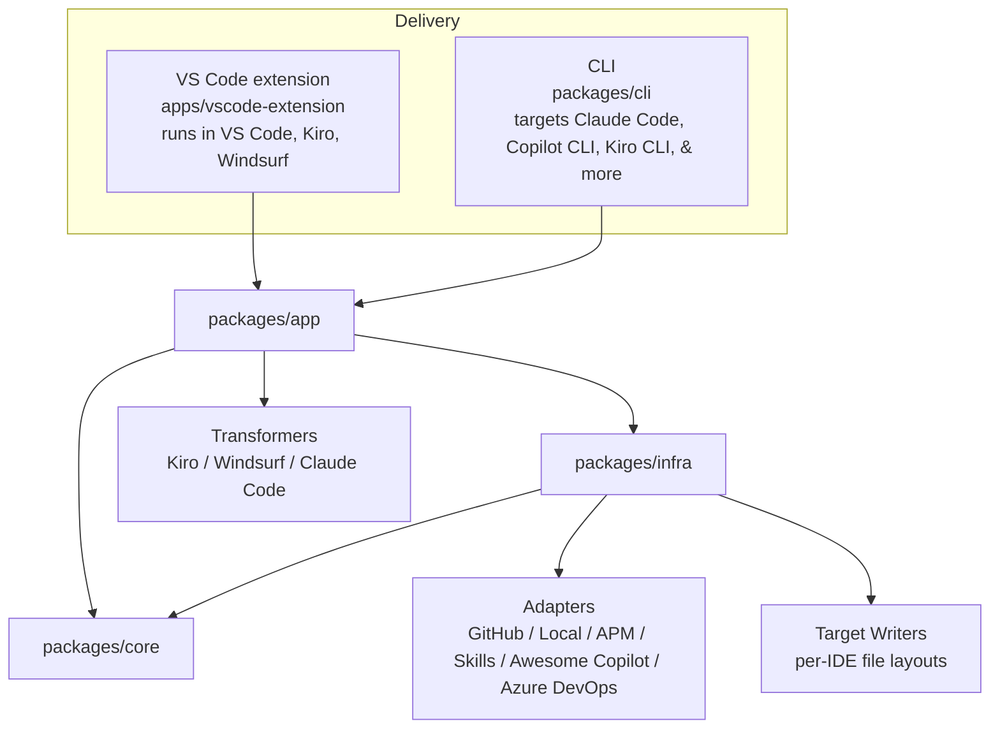

# 🎨 AI Primitives Hub

> One platform to discover, install, govern, and share AI primitives — prompts, instructions, agents, skills, and MCP server configurations — across every major AI coding tool. From a solo developer to teams and enterprise, the same primitives scale effortlessly.

[](https://marketplace.visualstudio.com/items?itemName=AmadeusITGroup.prompt-registry)
[](https://amadeusitgroup.github.io/ai-primitives-hub/)
[](https://opensource.org/licenses/Apache-2.0)
[](https://github.com/AmadeusITGroup/ai-primitives-hub/releases)

### Supported IDEs & CLIs


**AI Primitives Hub** gives you a single marketplace to manage the full lifecycle of AI primitives — discover, install, update, transform, and share — across VS Code, Kiro, Windsurf, Claude Code, Copilot CLI, Kiro CLI, and more. It runs as a VS Code extension or a standalone CLI, automatically adapting content (frontmatter, file layout, MCP config) to each target IDE.

> **ℹ️ Note:** This project was formerly known as **Prompt Registry**. The VS Code extension ID (`AmadeusITGroup.prompt-registry`) and lockfile names remain unchanged for compatibility — seeing `prompt-registry` in paths is expected.

## 📑 Table of Contents

- [Quick Start](#-quick-start)
- [Repository Structure](#-repository-structure)
- [Architecture](#%EF%B8%8F-architecture)
- [Documentation](#-documentation)
- [Contributing](#-contributing)
- [License](#-license)

## 🚀 Quick Start

**As a VS Code / Kiro / Windsurf user:**
Search "AI Primitives Hub" in the Extensions panel, or build from source using [`apps/vscode-extension/README.md`](./apps/vscode-extension/README.md). The extension auto-detects your editor and routes files to the correct directory.

**As a CLI user (Claude Code, Copilot CLI, Kiro CLI, or any terminal):**
```bash
npx ai-primitives-hub init          # interactive setup wizard
npx ai-primitives-hub install <bundle-id> --target <name>
```
See the [CLI User Flows](./docs/contributor-guide/architecture/library-centric-architecture/cli-user-flows.md) for the full command reference.

**As a collection author:**
See the [Author Guide](./docs/author-guide/creating-source-bundle.md).

**As a contributor:**

Requires Node.js 24 or newer and pnpm 11 or newer. See
[CONTRIBUTING.md](./CONTRIBUTING.md) for the complete development setup.

```bash
git clone https://github.com/AmadeusITGroup/ai-primitives-hub.git
cd ai-primitives-hub
pnpm install
pnpm build        # build all workspace packages
pnpm test         # run all workspace tests
pnpm lint
```

## 📁 Repository Structure

| Path | Purpose |
|------|---------|
| `apps/vscode-extension/` | VS Code extension: UI, commands, services, adapters (also runs in Kiro & Windsurf) |
| `packages/core/` | Domain types and port interfaces |
| `packages/infra/` | Adapter implementations: sources, stores, per-target writers, scaffolding |
| `packages/app/` | Use-case orchestration: install, registry, discovery, multi-target transforms |
| `packages/cli/` | `ai-primitives-hub` CLI — terminal interface calling `app` |
| `lib/` | Legacy collection scripts (deprecated in place) |
| `github-actions/validate-collections/` | Reusable GitHub Action for validating collections in CI |
| `docs/` | User, author, and contributor documentation |
| `website/` | Docusaurus documentation site |
| `packages/infra/src/hub/` | Shared Hub resolution, validation, and default-Hub definitions |

## 🏗️ Architecture

The monorepo is organized around a shared `core` domain, with `infra` adapters, an `app` orchestration layer, and thin delivery layers for the VS Code extension and the CLI.



For extension details, see the [Contributor Architecture Guide](./docs/contributor-guide/architecture.md).

### Supported Targets

AI Primitives Hub installs and transforms prompt bundles for the following targets:

| Target | Icon | Type | Extension Host Detection | CLI `--target` |
|--------|------|------|--------------------------|-----------------|
| **VS Code** | 🟦 | `vscode` | ✅ Default fallback | ✅ |
| **VS Code Insiders** | 🟩 | `vscode-insiders` | ✅ Detected via app name | ✅ |
| **Kiro / Kiro CLI** | 🟧 | `kiro` | ✅ Detected via app name (IDE) | ✅ |
| **Windsurf / Devin** | 🟫 | `windsurf` | ✅ Detected via app name | ✅ |
| **Claude Code** | 🟥 | `claude-code` | ❌ CLI-only (not a VS Code fork) | ✅ |
| **Copilot CLI** | ⬛ | `copilot-cli` | ❌ CLI-only | ✅ |

The extension auto-detects the host editor and routes files to the correct directory (`.github/`, `.kiro/`, `.windsurf/`). Devin is detected as Windsurf (they share the same paths and target type). Kiro CLI shares the same `.kiro/` directory as the Kiro IDE, so the `kiro` target covers both — no separate `kiro-cli` target is needed. The CLI can target any of the above explicitly via `--target`. Content transformers adapt frontmatter and file layout per target (e.g., Kiro requires `name` in agent frontmatter, Windsurf uses `trigger` fields, Claude Code requires `name` + `description`).

## 📚 Documentation

- [User Guide](./docs/user-guide/getting-started.md)
- [Author Guide](./docs/author-guide/creating-source-bundle.md)
- [Contributor Guide](./docs/contributor-guide/development-setup.md)
- [Architecture](./docs/contributor-guide/architecture.md)
- [Reference](./docs/reference/commands.md)

See the full index: [`docs/README.md`](./docs/README.md).

## 🤝 Contributing

See [CONTRIBUTING.md](./CONTRIBUTING.md) and [CODE_OF_CONDUCT.md](./CODE_OF_CONDUCT.md). For security, see [SECURITY.md](./SECURITY.md).

## 📄 License

[Apache 2.0](./apps/vscode-extension/LICENSE.txt)
