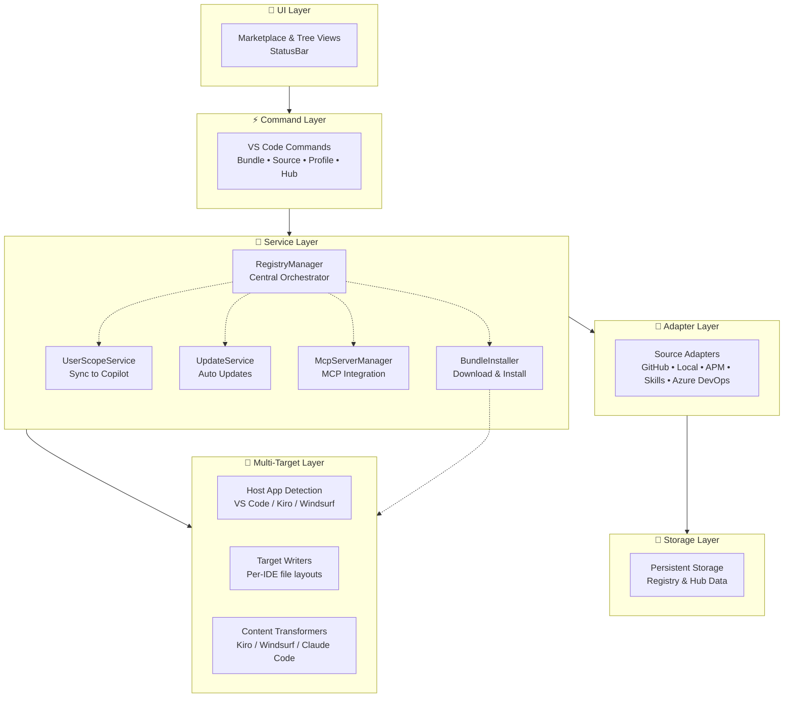
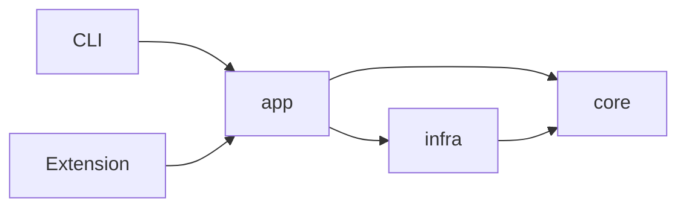
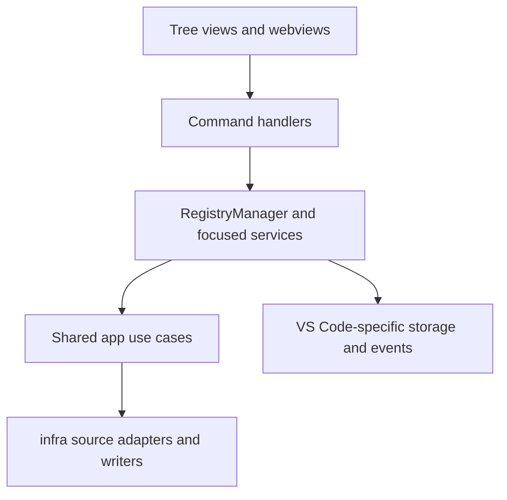
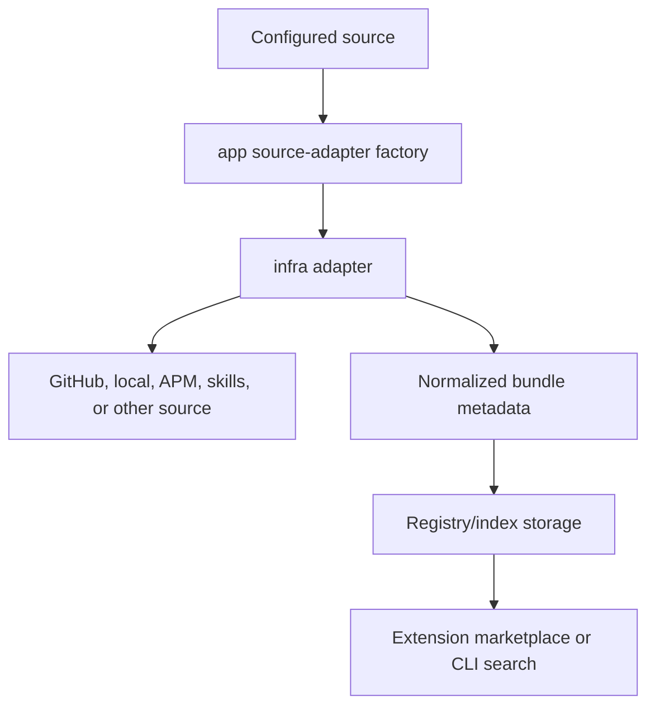
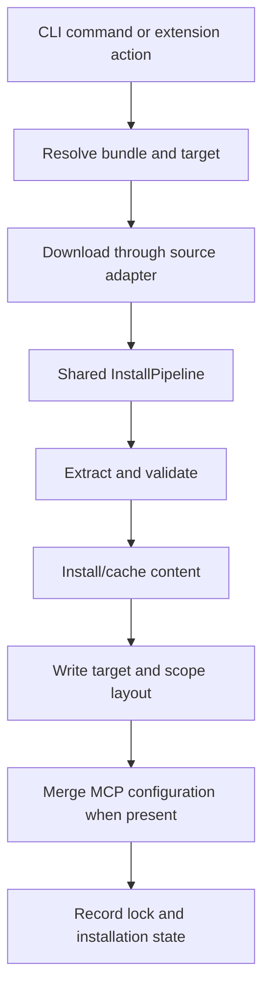
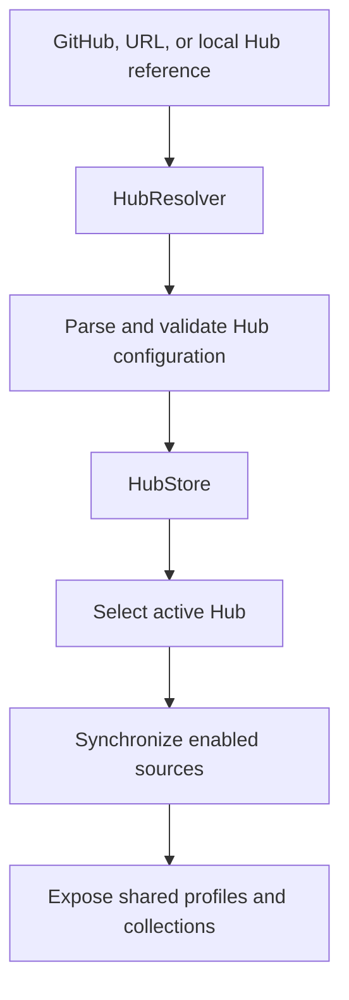

# Architecture Overview
AI Primitives Hub is one platform to discover, install, govern, and share AI primitives — prompts, instructions, agents, skills, and MCP server configurations — across every major AI coding tool. It runs as a VS Code extension (also in Kiro and Windsurf) and as a standalone CLI that targets VS Code, Kiro, Windsurf, Claude Code, Copilot CLI, and Kiro CLI, with per-IDE content adaptation and governance that scales from solo developers to teams to enterprise-wide primitive management.

## Current Shape

- Visual Marketplace with search/filter (extension)
- CLI with interactive init wizard and multi-target install
- Multi-source support (GitHub, Local, AwesomeCopilot, APM, Skills, Azure DevOps)
- Multi-target install with per-IDE file layouts and content transformers
- Bundle management (install, update, uninstall)
- Auto-sync with GitHub Copilot
- Cross-platform (macOS, Linux, Windows)
- MCP server integration

- The Clipanion CLI under `packages/cli/`
- The VS Code extension under `apps/vscode-extension/`

The CLI delegates most use cases to the shared packages. The extension also
uses the shared packages, but still owns VS Code-specific commands, UI,
storage wiring, events, notifications, and several compatibility facades. The
extension is therefore not yet only a thin shell.

## Package Responsibilities

| Area | Current responsibility |
|---|---|
| `packages/core` | Domain types, validation rules, errors, schemas, and ports for external capabilities |
| `packages/infra` | Implementations of core ports: source adapters, HTTP/GitHub access, stores, search, archives, scaffolding, layout loading, and target writers |
| `packages/app` | Use-case orchestration for installation, registry/Hub/profile operations, discovery, search, updates, and transforms |
| `packages/cli` | Clipanion commands, argument parsing, terminal output, and delivery-specific wiring |
| `apps/vscode-extension` | VS Code commands, views, webviews, progress, notifications, host detection, extension storage wiring, and compatibility facades over shared use cases |
| `lib` | Legacy collection build, validation, publishing, and release-analysis scripts |

The package dependency declarations enforce this shared direction:

`core` has no dependency on another `@ai-primitives-hub/*` package. `infra`
depends on `core`; `app` depends on both. The CLI also declares direct
dependencies on all three because its delivery wiring constructs concrete
adapters as well as calling application services.

## VS Code Extension

The extension currently has its own layered delivery architecture:

Important current boundaries:

File locations vary by target IDE:

| Target | User Scope | Repository Scope |
|--------|-----------|----------------|
| **VS Code** (macOS) | `~/Library/Application Support/Code/User/prompts` | `.github/prompts/` |
| **VS Code** (Linux) | `~/.config/Code/User/prompts` | `.github/prompts/` |
| **VS Code** (Windows) | `%APPDATA%/Code/User/prompts` | `.github/prompts/` |
| **VS Code Insiders** | Same structure with `Code - Insiders` | `.github/prompts/` |
| **Kiro / Kiro CLI** | `~/.kiro/` | `.kiro/` |
| **Windsurf / Devin** | `~/.codeium/windsurf/` | `.windsurf/` |
| **Claude Code** | `~/.claude/` | `.claude/` |
| **Copilot CLI** | `~/.copilot/` | `.github/` |

Supports: VS Code Stable, VS Code Insiders, Kiro/Kiro CLI, Windsurf/Devin (extension host detection); Claude Code, Copilot CLI, Kiro CLI (CLI-only targets).

## CLI

`packages/cli` is an active delivery layer, not scaffolding. It contains
commands for collections, primitives, bundles, sources, Hubs, profiles,
targets, discovery/indexing, installation, configuration, completion, and
diagnostics.

Commands parse input and format output. Shared business behavior belongs in
`packages/app`, with ports and domain rules in `core` and concrete adapters in
`infra`.

## Main Runtime Flows

### Discovery

### Installation

The delivery layers do not yet use identical wiring around every step. The
shared pipeline is the common generic sequence; the extension adds VS Code
progress, events, scope services, MCP handling, and its existing storage
model.

### Hub synchronization

A Hub is configuration that distributes sources and profiles. It does not
contain the primitive files itself. See
[Creating a Hub](../author-guide/creating-a-hub.md) for the author workflow
and [Hub Schema](../reference/hub-schema.md) for field definitions.

## Persistence and External Boundaries

| Boundary | Current implementation |
|---|---|
| Source content | GitHub, Azure DevOps, URLs, local files, APM, skills, and Awesome Copilot adapters where supported by the relevant source model |
| Shared application state | `AppStorage` port with the XDG-based infrastructure implementation |
| Extension state | VS Code extension storage facades plus repository lockfiles |
| Repository installation state | `prompt-registry.lock.json` and local-only lock/exclusion behavior |
| Target files | Host- and scope-aware writers/layout resolution |
| MCP state | Host configuration files plus managed-server tracking |

The existing `prompt-registry` identifiers are retained where changing them
would break compatibility. See ADR-0004 in the
[ADR index](./architecture/adr/adr-index.md).

## Documentation Boundaries

Use this page for the current system map. Keep detailed behavior in the
existing focused pages rather than repeating it here:

- [Adapters](./architecture/adapters.md)
- [Authentication](./architecture/authentication.md)
- [Installation Flow](./architecture/installation-flow.md)
- [Update System](./architecture/update-system.md)
- [UI Components](./architecture/ui-components.md)
- [MCP Integration](./architecture/mcp-integration.md)
- [Scaffolding](./architecture/scaffolding.md)
- [Validation](./architecture/validation.md)
- [Library-centric code map](./architecture/library-centric-architecture/codemap.md)
- [Architecture decisions](./architecture/adr/adr-index.md)

When these pages disagree with executable code, tests, or schemas, treat the
executable behavior as authoritative and correct the documentation.
ing](./architecture/scaffolding.md) — Project templates
- [Validation](./architecture/validation.md) — Schema validation
