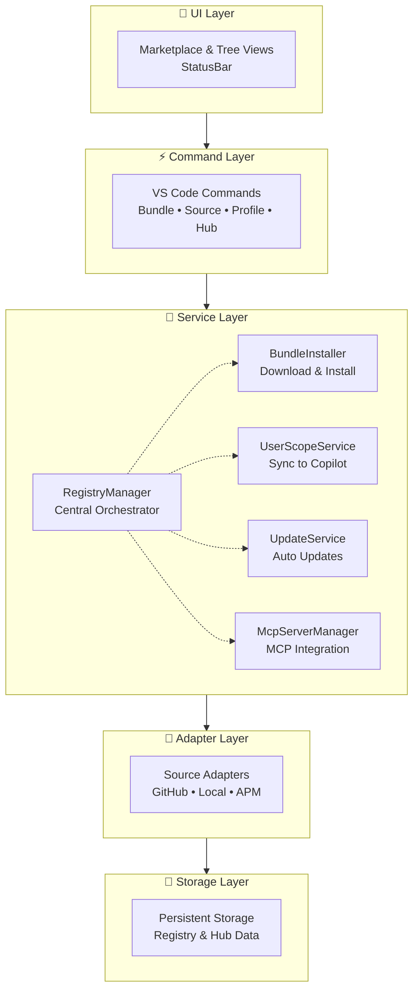

# Architecture Overview

VS Code extension providing a marketplace for GitHub Copilot prompt bundles from multiple sources.

## Key Features

- Visual Marketplace with search/filter
- Multi-source support (GitHub, Local, AwesomeCopilot, APM)
- Bundle management (install, update, uninstall)
- CLI with table-formatted output, shell completion, and scaffolding
- Auto-sync with GitHub Copilot
- Cross-platform (macOS, Linux, Windows)
- MCP server integration
- Proxy-aware HTTP requests (HTTP_PROXY/HTTPS_PROXY/NO_PROXY)
- Plugin and hook resource support

## Architecture Principles

1. **Separation of Concerns** — UI / Service / Adapter / Storage layers
2. **Adapter Pattern** — Unified interface for different sources
3. **Event-Driven** — React to installations, update UI dynamically
4. **Cross-Platform** — OS-specific path handling

## Component Architecture



## Component Responsibilities

| Component | Responsibility |
|-----------|---------------|
| **RegistryManager** | Orchestrates sources, bundles, installations |
| **BundleInstaller** | Extraction, validation, installation, MCP integration |
| **UserScopeService** | Syncs bundles to Copilot directories |
| **UpdateScheduler** | Manages timing of update checks |
| **UpdateChecker** | Detects available updates |
| **AutoUpdateService** | Background bundle updates with rollback |
| **McpServerManager** | MCP server installation/tracking |
| **McpConfigService** | Reads/writes VS Code's mcp.json |
| **HubManager** | Hub configuration and profile management |
| **SchemaValidator** | JSON Schema validation using AJV |
| **TemplateEngine** | Scaffold template loading and rendering |
| **NotificationManager** | User notifications and update alerts |

## Copilot Chat Skills

The extension ships built-in Copilot skills via the `contributes.chatSkills` entry in `package.json`.
To add a new skill:

1. Create a directory under `resources/skills/<skill-name>/` with a `SKILL.md` file
2. Register it in `package.json` under `contributes.chatSkills`:
   ```json
   "chatSkills": [
     { "path": "./resources/skills/<skill-name>/SKILL.md" }
   ]
   ```
3. If the skill references docs, add a build step to copy them into the skill's `references/` directory and git-ignore the generated files (see `copy-skill-references` in `package.json` for an example)
4. Ensure `.vscodeignore` and `.vscodeignore.production` include `!resources/**` so skills ship in the VSIX

> **Tip:** See `resources/skills/prompt-registry-helper/` for a complete example of a documentation-backed skill with build-time reference copying.

> **Heads up — build coupling:** The existing `copy-skill-references` npm script is tailored to `prompt-registry-helper`. Adding a new skill that also needs build-time references will likely require updating that script (or adding a new one) in `package.json`, along with corresponding `.gitignore` entries for the generated files.

> **Heads up — VSIX size:** Skill resources are packaged directly inside the `.vsix`. Be mindful of the size and number of reference files bundled with each skill — large or numerous resources will increase the extension's download and install footprint.

## Cross-Platform Paths

| Platform | Copilot Directory |
|----------|-------------------|
| macOS | `~/Library/Application Support/Code/User/prompts` |
| Linux | `~/.config/Code/User/prompts` |
| Windows | `%APPDATA%/Code/User/prompts` |

Supports: VS Code Stable, Insiders, Windsurf

## CLI Architecture

The CLI (`src/cli/`) provides a function-based command dispatch system. It is not clipanion-based — commands are dispatched via a switch statement in `index.ts`.

### Key Components

| Component | File | Responsibility |
|-----------|------|----------------|
| Command dispatch | `src/cli/index.ts` | Entry point, routes commands |
| Command definitions | `src/cli/cli.ts` | Supported commands, metadata, argument parsing |
| Output formatting | `src/cli/output.ts` | Text and JSON output renderers |
| Table renderer | `src/cli/table.ts` | Aligned column formatting for list commands |
| Help renderer | `src/cli/help-renderer.ts` | Progressive disclosure help with categories |
| Shell completion | `src/cli/completion.ts` | bash/zsh completion script generation |
| Error handling | `src/cli/errors.ts` | Error mapping and user-friendly messages |
| Scaffold command | `src/cli/commands/scaffold.ts` | Collection and primitive scaffolding |

### Output Modes

All commands support `--output text` (default) and `--output json`. JSON output uses a stable envelope with `command`, `status`, `data`, and `error` fields.

## Target Layout System

Target layouts define where bundle resources are placed for each target type and scope.

| Target | Scope | Config File |
|--------|-------|-------------|
| VS Code | user | `src/config/targets/vscode.ts` |
| VS Code | repository | `src/config/targets/vscode.ts` |
| Kiro | user | `src/config/targets/kiro.ts` |
| Kiro | repository | `src/config/targets/kiro.ts` |

Layouts are resolved via `TargetLayoutRegistry.resolveTargetLayout()` and used by `materializeFiles()` in `application-use-cases.ts`.

## Resource Transformers

Resource transformers modify bundle content during installation, applying target-specific transformations.

- `ResourceTransformer` interface in `src/services/resource-transformer.ts`
- Kiro transformer in `src/services/kiro-resource-transformer.ts` — injects mandatory fields for Kiro targets
- Transformers are applied in `materializeFiles()` during install

## Repository-Scope Safety

Repository-scoped installations are protected by safety policies:

- `RepositoryInstallPolicy` validates commit mode and resource types
- `LockfileManager` tracks installed files in `prompt-registry.lock.json`
- `ScopeConflictResolver` prevents same bundle at both user and repository scope

## Proxy-Aware Fetch

`src/utils/proxy-aware-fetch.ts` provides `createProxyAwareFetch()` which wraps undici's `EnvHttpProxyAgent` to respect standard proxy environment variables.

## Glossary

| Term | Definition |
|------|------------|
| **Bundle** | Package of prompts, instructions, chat modes, agents, skills, plugins, hooks |
| **Source** | Repository/location for fetching bundles |
| **Adapter** | Implementation for a source type |
| **Profile** | Collection of bundles grouped by project/team |
| **Manifest** | YAML file describing bundle contents |
| **Target** | Destination for bundle installation (type + scope) |
| **Resource Kind** | Type of bundle content (prompt, instruction, agent, skill, plugin, hook) |

## Deep Dives

- [Adapters](./architecture/adapters.md) — Adapter pattern and implementations
- [Authentication](./architecture/authentication.md) — Auth chain for private repos
- [Installation Flow](./architecture/installation-flow.md) — Bundle installation process
- [Update System](./architecture/update-system.md) — Auto-update architecture
- [UI Components](./architecture/ui-components.md) — Marketplace and TreeView
- [MCP Integration](./architecture/mcp-integration.md) — MCP server management
- [Scaffolding](./architecture/scaffolding.md) — Project templates
- [Validation](./architecture/validation.md) — Schema validation
- [CLI Usage](../user-guide/cli.md) — CLI command reference and examples
