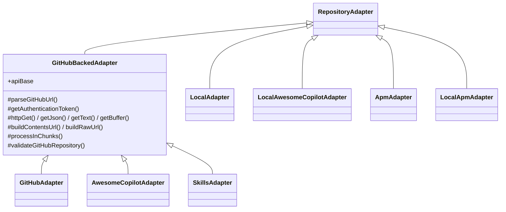

# Adapter Architecture

Adapters provide a unified interface for fetching bundles from different source types.

## IRepositoryAdapter Interface

```typescript
interface IRepositoryAdapter {
    readonly type: string;
    readonly source: RegistrySource;
    fetchBundles(onPartialBundles?: (bundles: Bundle[]) => void | Promise<void>): Promise<Bundle[]>;
    downloadBundle(bundle: Bundle): Promise<Buffer>;
    fetchMetadata(): Promise<SourceMetadata>;
    validate(): Promise<ValidationResult>;
    requiresAuthentication(): boolean;
    getManifestUrl(bundleId: string, version?: string): string;
    getDownloadUrl(bundleId: string, version?: string): string;
    forceAuthentication?(): Promise<void>;
}
```

## Class Hierarchy

The three GitHub-backed adapters share an intermediate abstract base, `GitHubBackedAdapter`, that
centralizes GitHub URL parsing, the authentication chain, the HTTP transport, and the progressive
chunked-fetch helper. Local (filesystem) adapters extend `RepositoryAdapter` directly.



`processInChunks(items, chunkSize, processItem, onPartial?)` runs each chunk with `Promise.allSettled`
(one failure drops only that item) and invokes `onPartial` with a growing snapshot after each chunk.
This is what drives the marketplace/tree views to fill in progressively during large source syncs,
rather than appearing frozen until every source finishes.

## Adapter Types

| Adapter | Source Type | Base Class | Installation Method | Status |
|---------|-------------|------------|---------------------|--------|
| **GitHubAdapter** | `github` | GitHubBackedAdapter | URL-based (getDownloadUrl) | Active |
| **AwesomeCopilotAdapter** | `awesome-copilot` | GitHubBackedAdapter | Buffer-based (builds zip on-the-fly) | Active |
| **SkillsAdapter** | `skills` | GitHubBackedAdapter | Buffer-based (builds zip on-the-fly) | Active |
| **LocalAdapter** | `local` | RepositoryAdapter | Buffer-based (downloadBundle) | Active |
| **LocalAwesomeCopilotAdapter** | `local-awesome-copilot` | RepositoryAdapter | Buffer-based | Active |
| **LocalSkillsAdapter** | `local-skills` | RepositoryAdapter | Buffer-based | Active |
| **ApmAdapter** | `apm` | RepositoryAdapter | URL-based | Active |
| **LocalApmAdapter** | `local-apm` | RepositoryAdapter | Buffer-based | Active |

Source types are defined in `src/types/registry.ts`:
```typescript
export type SourceType = 'github' | 'local' |
    'awesome-copilot' | 'local-awesome-copilot' | 'apm' | 'local-apm' | 'skills' | 'local-skills';
```

> **Freshness note:** `LocalAwesomeCopilotAdapter` does not cache its bundle list. `fetchBundles()` re-reads collection files from disk on every call so local edits (including readmes) are reflected immediately during development.
>
> **Readme revision reuse:** For remote sources, `RegistryManager` carries a cached readme over to a freshly synced bundle only when the bundle's `readmeRevision` is unchanged; otherwise the readme is re-downloaded. This keeps readmes fresh while avoiding redundant downloads on every sync. Adapters set `readmeRevision` to a value that changes when the readme content can change — the GitHub adapter uses the release tag, and the Awesome Copilot adapter uses the configured branch's head commit sha (so a stale readme is refreshed once the branch advances). If an adapter cannot resolve a revision, it leaves `readmeRevision` unset and the readme is re-downloaded on every sync.
>
> **Readme asset resolution (GitHub):** The GitHub adapter does not guess the readme filename. GitHub names each release asset after the uploaded file's basename, and a collection may declare any readme path (e.g. `docs/collection-overview.md`), so the deployment manifest records the readme asset basename in its `readme` field (written by `lib/bin/generate-manifest.js`). `processSingleRelease` reads `manifest.readme` and matches it against the release assets; if the manifest omits `readme`, no readme is attached.

## Two Installation Paths

**URL-Based** (`install()`):
- Pre-packaged zip bundles on remote servers
- Direct download from URL
- Used by: GitHub, AwesomeCopilot

**Buffer-Based** (`installFromBuffer()`):
- Dynamically created bundles
- Builds zip in memory
- Used by: AwesomeCopilot, Local

## Adding a New Adapter

```typescript
// 1. Extend GitHubBackedAdapter for GitHub sources (inherits auth/HTTP/URL/chunking),
//    or RepositoryAdapter for non-GitHub sources (implement auth/HTTP yourself).
export class MyAdapter extends GitHubBackedAdapter {
    readonly type = 'my-type';

    // Stream partial results so the UI renders progressively during large syncs.
    async fetchBundles(onPartialBundles?: (b: Bundle[]) => void | Promise<void>): Promise<Bundle[]> {
        const items = await this.getJson<Item[]>(/* ... */);
        return this.processInChunks(items, 10, (item) => this.toBundle(item), onPartialBundles);
    }
    async downloadBundle(bundle: Bundle): Promise<Buffer> { /* ... */ }
    async fetchMetadata(): Promise<SourceMetadata> { /* ... */ }
    async validate(): Promise<ValidationResult> { /* ... */ }
    getManifestUrl(bundleId: string, version?: string): string { /* ... */ }
    getDownloadUrl(bundleId: string, version?: string): string { /* ... */ }
}

// 2. Register in factory
RepositoryAdapterFactory.register('my-type', MyAdapter);

// 3. Add to SourceType union in src/types/registry.ts
export type SourceType = 'github' | 'local' |
    'awesome-copilot' | 'local-awesome-copilot' | 'apm' | 'local-apm' |
    'skills' | 'local-skills' | 'my-type';
```

## See Also

- [Authentication](./authentication.md) — Auth for private repos
- [Installation Flow](./installation-flow.md) — How bundles are installed
