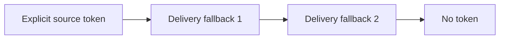
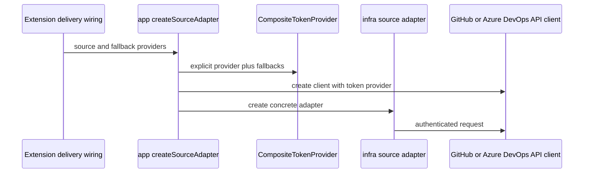

# Source Authentication

Authentication is provided to shared source adapters through the
`TokenProvider` port. The shared adapters do not import VS Code APIs or read
delivery-specific settings directly.

## Current Token Chain

`packages/app/src/registry/create-source-adapter.ts` builds a
`CompositeTokenProvider` for authenticated sources:

The order is:

1. `source.token`, when configured
2. Fallback providers supplied by the delivery layer, in their supplied order
3. Anonymous access when no provider returns a token

This legacy chain applies only when source-aware App mode is disabled. The
source-aware path below requires a generic credential before its first GitHub
request and never uses this anonymous fallback.

For the VS Code extension, the fallback providers are:

1. The selected VS Code GitHub authentication session
2. `gh auth token` through `GhCliTokenProvider`

The GitHub CLI provider has a three-second timeout so a missing or
unresponsive executable does not block the extension indefinitely.

## Construction Flow

GitHub API requests use the token format implemented by
`packages/infra/src/http/github-api-client.ts`. Azure DevOps uses its own
Basic-auth PAT encoding in `azure-devops-api-client.ts`. Bundle downloaders
may use a different authorization scheme required by their endpoint; use the
relevant client implementation as the authority.

## CLI Source-Aware Authentication

The CLI and primitive-index harvester have an explicit, opt-in source-aware
mode for CI workflows that need repository-scoped GitHub App installation
tokens. The switch is `AI_PRIMITIVES_HUB_GH_APP_AUTH_ENABLED`; when it is
unset or false, the existing developer token chain remains unchanged and the
App CLI is never invoked.

When enabled, the runtime parses the configured GitHub sources and performs
the required source-type operations with a generic GitHub credential before
selecting any repository-scoped App credential. Anonymous GitHub traffic is
disabled in this mode. Each source receives one of these evidence-based
categories:

| Category | Runtime behavior |
|---|---|
| `public-generic` | Use `GH_TOKEN`, then `GITHUB_TOKEN` in CI, or local `gh auth token`; no anonymous fallback is permitted. |
| `app-authenticated` | Invoke `gh app-auth token` with the source repository as `--repo`; no generic or personal fallback is allowed. |
| `unresolved` | Fail the requested operation before source work; do not omit or silently reclassify the source. Missing generic credentials, ambiguous visibility, inaccessible repositories, and failed source operations are unresolved. |

`AI_PRIMITIVES_HUB_GH_PUBLIC_AUTH_MODE` selects the public policy:
`auto` (default) or `generic`. Both modes require an authenticated generic
credential. The legacy value `anonymous` is rejected with
`GH_PUBLIC_ANONYMOUS_DISABLED`. The App selector and isolated configuration
are supplied through the
`AI_PRIMITIVES_HUB_GH_APP_AUTH_APP_ID` or
`AI_PRIMITIVES_HUB_GH_APP_AUTH_CLIENT_ID`, together with
`AI_PRIMITIVES_HUB_GH_APP_AUTH_CONFIG`. The implementation passes the
repository target separately from the request host, so API, raw-content, and
asset requests for one repository receive the same repository-scoped token.

For machine-readable consumers, source-aware validation returns the sanitized
preflight report as `data.sourcePreflight`. Source-aware harvest failures use
`GH_SOURCE_PREFLIGHT_FAILED` internally and expose the same report under
`errors[0].context.sourcePreflight`; the report contains repository targets,
categories, checked operations, and stable error codes, but no credentials.

App setup is a separate bootstrap operation. `gh app-auth setup` receives
wildcard routes derived from the sources that actually require
authentication; runtime token lookup never performs setup or discovers
installations. For the CLI's explicit bootstrap flow, `hub validate --check-sources`
and `index harvest` accept an App ID, a PEM path, and a local hub YAML path.
They create a private temporary filesystem config, derive the
routes after generic preflight, run setup, reuse the resulting runtime, and
remove the temporary config in `finally` cleanup. Setup is therefore automatic
only when the caller explicitly supplies bootstrap inputs; it is never a
hidden side effect of `TokenProvider.getToken()`.

Keep private keys in the CI secret store or a restrictive temporary mount, and
use placeholders in documentation and automation examples. Installation
tokens are held in memory, cached per exact repository with a conservative
lifetime, and never written to logs or persistent cache. Source-aware
preflight fails promptly with `GH_PUBLIC_GENERIC_RATE_LIMIT_UNSAFE` when the
authenticated generic path is rate limited; it never wait-retries through an
anonymous tier or silently falls back to one. Private or ambiguous metadata
still follows the App or unresolved path.

The cache lifetime is command-scoped. Lockfile installs and profile activation
reuse one source-aware runtime across bundle references, so multiple bundles
from the same repository share one preflight and one cached App token. Harvest
also reuses the verified default-branch revision from preflight instead of
issuing a second commit lookup. Token values remain process-local; a separate
warm-up command cannot populate a later process and tokens are never persisted.

## GitHub API quota and CI design limits

Source-aware authentication must be budgeted as an API workload, not just as a
token-minting feature. GitHub has several independent constraints:

- A personal access token normally has a 5,000-request-per-hour primary REST
  limit.
- A GitHub App *installation access token* for an installation on GitHub
  Enterprise Cloud can have a 15,000-request-per-hour primary limit. That is
  an installation-level bucket, not 15,000 requests for every repository or
  every token minted by the installation.
- The generic credential and App credential are both used by the current
  source-aware design: generic authentication establishes visibility and
  serves public sources; repository-scoped App tokens serve sources requiring
  authentication. A healthy App bucket therefore does not prove that the
  generic 5,000-request bucket is healthy. GitHub also documents that some
  higher-limit App/OAuth requests made on a user's behalf can reduce the
  lower-limit user budget, so the actual response headers must be treated as
  authoritative for the selected token type.
- Primary limits are not the only limit. GitHub's secondary controls include
  a maximum of 100 concurrent requests across REST and GraphQL, endpoint
  point-rate limits, CPU-time limits, and limits on token requests. Secondary
  limits can be reached before the primary hourly counter is exhausted.

The `GET /rate_limit` endpoint reports primary buckets and does not consume
primary quota, but it is not a complete health check: GitHub states that there
is no endpoint for querying secondary-limit state. Check the
`x-ratelimit-*` headers on real API responses and stop on a `403`/`429` rather
than polling through the failure. In one 2026-08-23 observation,
`/rate_limit` reported thousands of primary requests remaining for the EMU
credential while ordinary authenticated endpoints returned `403` with
`x-ratelimit-remaining: 0` and a future reset time. The exact dynamic throttle
could not be identified from public headers, so CI must classify this as
*quota unavailable* rather than assume that primary quota is still usable.

### Measured request shape

The optimized clean-hub instrumentation used 47 sources (46 App-bound and one
generic-public) and 60 lifecycle bundle references. It measured HTTP request
attempts, not token values, as follows:

| Flow | Developer credential | CI-simulated App | App-mode delta |
|---|---:|---:|---:|
| `hub validate --check-sources` | 562 | 754 | +192 |
| `index harvest` | 1,038 | 1,183 | +145 |
| `install --lockfile` | 159 | 298 | +139 |
| `update --lockfile --dry-run` | 109 | 248 | +139 |
| **All four flows** | **1,868** | **2,483** | **+615** |

These are aggregate counts across credential categories; they must not be
read as 2,483 requests against the App bucket or 1,868 requests against the
personal bucket. Per-category counters are required before setting a precise
per-token budget. They do show that repeating the complete matrix several
times in one rolling hour is unsafe, especially when the same EMU identity is
also used by other jobs or interactive tooling.

For a source-aware preflight, a useful planning estimate is:

$$
Q_p \approx 3S + A + D + R
$$

where $Q_p$ is the preflight request count, $S$ is the number of sources, and
$A$ is the number that require the App
metadata check after generic visibility fails, $D$ is the number of
collection/plugin directory checks, and $R$ is the number of release metadata
checks. The three $S$ terms are generic visibility metadata, branch commit,
and recursive tree. For the clean validation scope this predicted
$3(47)+46+5=192$ preflight requests. The lifecycle scope had 28 sources,
27 App-bound sources, four collection checks, and 24 release checks, yielding
$3(28)+27+4+24=139$. The estimate excludes retries and operation requests;
source-specific fallback paths can add requests.

The cost scales with more than source count. A changed source revision causes
tree and content/blob reads, and each uncached primitive candidate can add a
raw-content request. The content-addressed blob cache reduces warm harvest
cost, but only if CI preserves a safe cache between jobs. App tokens must not
be placed in that cache.

### CI operating policy

Until per-category request telemetry is available, use conservative scheduling
and budgets:

1. Do not run validation, harvest, install, and update as four independent
  checks on every push. Run static/offline validation on pull requests; run
  one source-aware harvest on a controlled schedule; reserve lifecycle
  install/update checks for release or scheduled jobs.
2. Serialize jobs that use the same generic identity or App installation.
  Use CI concurrency cancellation so an obsolete full-hub run cannot consume
  the budget while a newer run starts.
3. Treat the observed clean-hub counts as minimum planning baselines. A first
  guardrail of roughly 1,000 attempts for full validation, 1,500 for harvest,
  400 for install, and 350 for update includes modest headroom over the
  measured run; these are engineering budgets, not GitHub guarantees. A
  complete matrix should be budgeted at roughly 3,100 aggregate attempts
  before it is allowed to start, with additional reserve for retries and
  concurrent consumers.
4. Perform a generic-credential canary against a representative repository
  and inspect its response headers before starting a large job. Use
  `/rate_limit` for primary accounting, but do not use it as the only canary
  because it cannot reveal secondary throttling. If either canary is
  throttled, abort the job and wait for the provider's reset guidance.
5. Record, without secrets, request count and attempts by authentication
  category, status-code counts, `304` counts, token-mint process counts,
  `x-ratelimit-limit`, `x-ratelimit-remaining`, `x-ratelimit-used`, and
  `x-ratelimit-reset`. This is necessary to distinguish primary exhaustion,
  secondary throttling, App installation limits, and generic-user limits.
6. Keep the repository/blob/ETag cache warm across CI jobs where the security
  model permits it. Key it by hub/source revision and invalidate it when the
  source or authentication category changes. Never persist installation
  tokens or private keys.

The implementation now trips a fail-closed preflight circuit after the first
generic rate-limit response: remaining sources are marked
`GH_PUBLIC_GENERIC_RATE_LIMIT_UNSAFE` without further probes. This avoids
turning one quota outage into dozens of identical requests. It does not remove
the need for CI-level serialization, canary checks, or budget accounting.

Official references: [REST API rate limits](https://docs.github.com/en/rest/using-the-rest-api/rate-limits-for-the-rest-api),
[REST API best practices](https://docs.github.com/en/rest/using-the-rest-api/best-practices-for-using-the-rest-api),
and [REST API rate-limit endpoints](https://docs.github.com/en/rest/rate-limit/rate-limit).

## First-Run GitHub Account Selection

On first-run setup, the extension invokes
`promptGitHubAccountSelection` before Hub selection. It calls VS Code's GitHub
authentication provider with `clearSessionPreference: true`, allowing the
user to select an account even when VS Code already has a preferred session.

After selection, normal token-provider calls reuse the selected session. The
**Force GitHub Authentication** command remains available when the user needs
to choose another account.

If the first-run picker is dismissed, setup remains incomplete and can be
resumed later.

## Security Rules

- Do not commit tokens to Hub or collection repositories.
- Do not log full tokens or token previews.
- Keep authentication at delivery/infrastructure boundaries; do not import
  VS Code authentication APIs into `core` or `app`.
- Prefer the user's selected VS Code session or existing GitHub CLI session
  over copying credentials into configuration.
- Treat authentication failures separately from missing repositories when
  reporting private-source errors.

## See Also

- [Source Adapter Architecture](./adapters.md)
- [User Guide: Sources](../../user-guide/sources.md)
- [Creating a Hub](../../author-guide/creating-a-hub.md)
