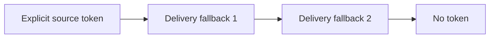
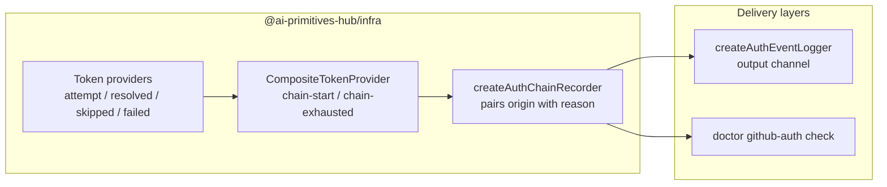
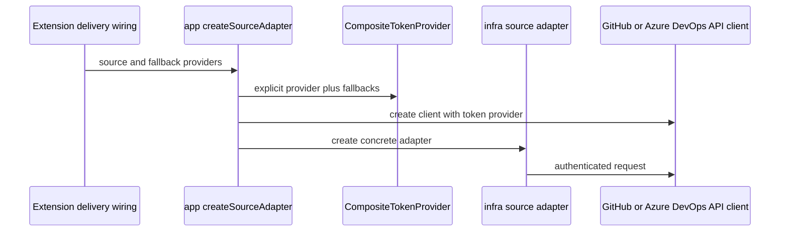

# Source Authentication

Authentication is provided to shared source adapters through the
`TokenProvider` port. The shared adapters do not import VS Code APIs or read
delivery-specific settings directly.

## Current Token Chain

`packages/app/src/registry/create-source-adapter.ts` builds a
`CompositeTokenProvider` for authenticated sources:



The order is:

1. `source.token`, when configured
2. Fallback providers supplied by the delivery layer, in their supplied order
3. Anonymous access when no provider returns a token

For the VS Code extension, the fallback providers are:

1. The selected VS Code GitHub authentication session
2. `gh auth token` through `GhCliTokenProvider`

The GitHub CLI provider has a three-second timeout so a missing or
unresponsive executable does not block the extension indefinitely.

## Token Origins

Resolution is reported in user-facing terms rather than by implementing
class, so a log line doubles as a remediation hint. `TokenOrigin`
(`packages/infra/src/auth/auth-event.ts`) has four values:

| Origin | Source | Provider |
|---|---|---|
| `configured-token` | The `promptregistry.githubToken` setting, or a source's own `token` | `StaticTokenProvider` |
| `env-var` | `GITHUB_TOKEN` or `GH_TOKEN` | `EnvTokenProvider` (CLI only) |
| `gh-cli` | `gh auth token` | `GhCliTokenProvider` |
| `ide-session` | The editor's GitHub sign-in | `VsCodeSessionTokenProvider` |

`env-var` is wired into the CLI's `defaultTokenProvider` only. The
extension has no environment-variable step; users configure
`promptregistry.githubToken`, which
`RegistryManager.enrichSourceWithGlobalToken` folds into `source.token`
so it arrives as `configured-token`.

## Observability

Providers report resolution through an optional `onAuthEvent` handler,
following the same injected-callback shape as `GitHubApiClient`'s
`onEvent`. `infra` stays free of any logger dependency; each delivery
layer formats the events itself.



Events are facts reported as they happen: each origin announces its own
outcome, and `chain-exhausted` carries only the origins tried. Pairing an
origin with the reason it declined is the consumer's job, done once in
`createAuthChainRecorder` and shared by both delivery layers.

The extension logs one INFO line per completed resolution and keeps
per-step detail at DEBUG (`LOG_LEVEL=DEBUG`):

```text
[Auth] source=my-private-hub host=api.github.com via=ide-session type=gho_ scopes=repo,read:user (142ms)
[Auth] source=my-private-hub host=api.github.com no token — tried: configured-token(not-set), ide-session(no-session), gh-cli(gh-not-authenticated)
```

`scopes` reads `unknown` for every origin except `ide-session`, the only
one that learns its scopes locally (VS Code supplies them on the session
object). The others would need GitHub's `x-oauth-scopes` response header.

`GhCliTokenProvider` distinguishes `gh-not-installed`,
`gh-not-authenticated`, `gh-timeout`, and `gh-empty-output` rather than
declining silently.

### Construction sites

The extension builds a token chain in four places, each supplying its own
labelled handler:

| Site | Label |
|---|---|
| `src/adapters/infra-adapter-factory.ts` | the source id |
| `src/services/hub-manager.ts` | `hub-resolution` |
| `src/services/registry-manager.ts` (revision resolution) | the source id |
| `src/services/registry-manager.ts` (primitive index) | the source id |

The `hub-manager.ts` chain has no `StaticTokenProvider`, so hub
resolution does not consult `promptregistry.githubToken`. Its `[Auth]`
lines make that visible: they report `via=ide-session` or `via=gh-cli`
where a user who set the token would expect `via=configured-token`.

## Construction Flow



GitHub API requests use the token format implemented by
`packages/infra/src/http/github-api-client.ts`. Azure DevOps uses its own
Basic-auth PAT encoding in `azure-devops-api-client.ts`. Bundle downloaders
may use a different authorization scheme required by their endpoint; use the
relevant client implementation as the authority.

## First-Run GitHub Account Selection

On first-run setup, the extension invokes
`promptGitHubAccountSelection` before Hub selection. It calls VS Code's GitHub
authentication provider with `clearSessionPreference: true`, allowing the
user to select an account even when VS Code already has a preferred session.

After selection, normal token-provider calls reuse the selected session. The
**Force GitHub Authentication** command remains available when the user needs
to choose another account.

If the first-run picker is dismissed, setup remains incomplete and can be
resumed later.

## Security Rules

- Do not commit tokens to Hub or collection repositories.
- Do not log full tokens or token previews. `describeTokenType` returns a
  fixed literal from a closed set (`gho_`, `ghp_`, `ghu_`, `ghs_`, `ghr_`,
  `github_pat_`, `opaque`) - a category, not a fragment of the secret. Do
  not extend it to report token length or trailing characters. The six
  prefixes are GitHub's documented set; see
  [GitHub credential types](https://docs.github.com/en/organizations/managing-programmatic-access-to-your-organization/github-credential-types)
  for the credential and lifespan behind each.
- Do not log the account label or any other account identity alongside a
  resolved token; the origin and its scopes are sufficient for diagnosis.
- Keep authentication at delivery/infrastructure boundaries; do not import
  VS Code authentication APIs into `core` or `app`.
- Prefer the user's selected VS Code session or existing GitHub CLI session
  over copying credentials into configuration.
- Treat authentication failures separately from missing repositories when
  reporting private-source errors.

## See Also

- [Source Adapter Architecture](./adapters.md)
- [User Guide: Sources](../../user-guide/sources.md)
- [Creating a Hub](../../author-guide/creating-a-hub.md)
