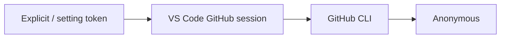

# Authentication

GitHub credentials reach every fetch through `core`'s `TokenProvider` port.
A provider resolves a token **with its origin**, so any failure can say
which credential was used and where it came from — the question a status
code never answers, and the one that decides what the user should fix.

## Authentication Chain



`CompositeTokenProvider` walks the chain and returns the first hit,
unchanged — origin included. The links differ per delivery layer:

| Layer | Chain | Wired in |
|---|---|---|
| VS Code extension | `VsCodeSessionTokenProvider` → `GhCliTokenProvider` | `src/adapters/infra-adapter-factory.ts` |
| CLI | `EnvTokenProvider` → `GhCliTokenProvider` | `infra`'s `defaultTokenProvider` |

A per-source `RegistrySource.token`, or the global
`promptregistry.githubToken` setting, is prepended as a
`StaticTokenProvider` ahead of the chain.

The `gh` CLI step has a **3-second timeout** so a missing or unresponsive
`gh` cannot hang a request; the chain then falls through to anonymous,
rate-limited access.

Tokens are sent in GitHub's legacy header form:

```typescript
headers.Authorization = `token ${credential.token}`;
```

## Token Origin

`TokenOrigin` travels with every resolved token. Each provider
self-reports; nothing downstream has to guess.

| `kind` | `detail` | Produced by |
|---|---|---|
| `explicit` | — | a token passed in directly (`RegistrySource.token`) |
| `setting` | `promptregistry.githubToken` | the extension's global token setting |
| `vscode-session` | the GitHub account label | `VsCodeSessionTokenProvider` |
| `env` | `GITHUB_TOKEN` or `GH_TOKEN` | `EnvTokenProvider` |
| `gh-cli` | `gh auth token` | `GhCliTokenProvider` |
| `unknown` | — | a source that could not be attributed |

`formatCredential` renders it for logs and error context, and is the only
approved way to mention a credential in output:

```
origin=anonymous
origin=vscode-session(octocat) token=***<len=40,tail=9c1e>
origin=setting:promptregistry.githubToken token=***<len=93,tail=4f2a>
```

Token values are never logged. `redactToken` emits `***<len=N,tail=abcd>`
— the length plus the **last four characters**, enough to compare against
`gh auth token` without exposing the secret. These strings now also reach
user-facing notification text through `describeError`, not just the output
channel, so keep them redacted.

## Account Selection on First Run

When AI Primitives Hub is installed for the first time (setup state
`NOT_STARTED`), `Extension.initializeHub()` calls
`promptGitHubAccountSelection` before the hub selector opens. That helper
invokes:

```typescript
vscode.authentication.getSession('github', ['repo'], {
  clearSessionPreference: true,
  createIfNone: true,
});
```

`clearSessionPreference: true` forces VS Code's native account picker to
appear — including the "Sign in to another account…" entry — even when a
trusted session already exists. This prevents the extension from silently
inheriting whichever default account VS Code has chosen, which is the root
cause of "I can't see my private hub even though I'm logged in" reports.

After the user picks an account, VS Code persists that preference. All
subsequent auth calls use the standard chain above without
`clearSessionPreference`, so they silently reuse the chosen account.

If the user dismisses the picker, `promptGitHubAccountSelection` throws;
the existing catch in `initializeHub` calls
`SetupStateManager.markIncomplete()` and the marketplace renders the
"Setup Not Complete" empty state on the next launch. The "Force GitHub
Authentication" command (`promptregistry.forceGitHubAuth`) remains the
path to re-pick an account later. It uses `forceNewSession` plus
`clearSessionPreference`: a brand-new token and a chance to switch
accounts.

`VsCodeSessionTokenProvider` logs the account label, the scopes VS Code
actually granted (a reused session can be narrower than requested) and the
redacted token on every resolution, so the credential behind a later 404 is
identifiable from the log alone.

## Diagnosing a Rejected Credential

`raw.githubusercontent.com` — where every collection manifest, bundle file
and hub config is fetched from — **never answers 401 or 403**. A rejected
token, a token without the `repo` scope, a token that is not
SAML-SSO-authorized for the owning organization, and a path that truly does
not exist all produce the same response:

```
GitHub API error: 404 - Not found or not accessible. Check authentication.
```

### No anonymous fallback, by design

Neither `GitHubApiClient` nor the hub resolver retries a failed request
without the credential. A rejected credential fails the fetch, every time.
Serving public content anonymously would hide the fault instead of fixing
it — the hub would load today and every private hub would keep failing with
no explanation — so `hub-resolver.ts` makes exactly **one** authenticated
request, diagnoses the credential when that request fails, and throws.

The throw is a `RegistryError` whose code names the cause, so callers
classify without matching message text:

| Code | Meaning |
|---|---|
| `AUTH.TOKEN_REJECTED` | GitHub rejected the credential itself (401 on `/user`) |
| `AUTH.MISSING_SCOPE` | valid token, no `repo` scope |
| `AUTH.SSO_REQUIRED` | valid token, not SSO-authorized for the organization |
| `AUTH.NO_REPO_ACCESS` | valid token and scopes, but this account cannot see the repository |
| `HUB.FETCH_FAILED` | anonymous request, or `api.github.com` unreachable (network/proxy) |

`error.hint` carries the plain-language verdict and `error.context` carries
`{ url, repoLocation, status, origin, scopes, sso, login }`.

### Auth context on every fatal error

Fatal GitHub errors carry the credential *and its origin* plus whatever
GitHub said about it:

```
GitHub API error: 404 - ... (https://raw.githubusercontent.com/org/repo/main/collections/a.collection.yml)
  [origin=setting:promptregistry.githubToken token=***<len=82,tail=4f2a>, token-scopes=read:user, accepted-scopes=repo, sso=required]
```

- `origin=anonymous` — no provider in the chain had a credential.
- `origin=…` — the credential to fix, named at its source.
- `token-scopes` missing `repo` — private repositories are invisible.
- `sso=…` — the token needs authorizing for that organization.

The same context now appears on bundle downloads
(`https-bundle-downloader.ts`) and in `ai-primitives-hub doctor` output.

### The Diagnose command

`Diagnose GitHub Authentication` (`promptregistry.diagnoseGitHubAuth`) is
**targeted**: it diagnoses the repository named by the caller
(`execute({ url, label })` — the URL from the failure), never a sweep of
every configured source. It resolves the credential through a
non-interactive chain (`createIfNone: false`, so read-only diagnostics
cannot pop a sign-in modal and then report on a session that was not the
one that failed), then probes `api.github.com` — which *is* honest about
auth failures — with `diagnoseGitHubToken`: `GET /user` for validity,
scopes and login, then `GET /repos/{owner}/{repo}` for access. When
`/user` already rejected the credential the repo probe never runs, and
`report.repoStatus === undefined` states that as a fact.

A **control probe** (`probeRawContentWithCredential`) fetches a
known-public raw URL with the credential and, only if that fails, without
it. The control URL is a constant, unambiguously public README — not the
recommended default hub, which is private and would make "the control
failed" indistinguishable from "no access to that repository". This is a
diagnosis, not a fallback: nothing the user asked for is served from it. It
separates the last two explanations a 404 can have:

- authenticated read succeeds → the credential works on the host that
  serves bundles, so the original 404 was about that path or repository;
- authenticated read fails where the anonymous one succeeds → GitHub is
  rejecting the credential, and no private content will load until it is
  replaced.

Every verdict is logged with `origin=` in the headline.

### What the user sees

A failing operation always produces a notification — the failure is never
replaced by a diagnostic. `showAuthFailure` (`utils/show-auth-failure.ts`)
shows the original message plus the verdict and offers *Diagnose*, *Reset
GitHub Token* and *Show Logs*:

```
Failed to install bundle: GitHub API error: 404 — GitHub rejected the credential itself (401 on /user): it is expired, revoked, or not a GitHub API token.
[Diagnose] [Reset GitHub Token] [Show Logs]
```

Non-auth failures (`HUB.FETCH_FAILED`, anything that is not a
`RegistryError` with an `AUTH.` code) keep a plain error notification.

## Expected: no access to a default hub

An account with no access to the default `Amadeus-xDLC/genai.prompt-registry-config`
hub — an open-source contributor outside Amadeus — is an **expected**
condition, not a fault. It is logged at `info`, never `warn` or `error`,
and never raises a notification during hub verification:

```
[FirstRun] ⓘ Hub not available to this account: Amadeus (github:Amadeus-xDLC/genai.prompt-registry-config)
[FirstRun]   Credential: origin=vscode-session(octocat) token=***<len=40,tail=9c1e>
[FirstRun]   credential is valid and belongs to octocat, but that account cannot see Amadeus-xDLC/genai.prompt-registry-config (status 404).
[FirstRun]   Expected for accounts outside the owning organization. This is not an error.
```

The rule, implemented in `utils/first-run-hub-report.ts`:

- `reason === 'no-access'` **and** `isDefaultHub(reference)` → `info`, no
  notification. `no-access` only occurs when `/user` succeeded, so the
  credential is known to be valid.
- any other reason → `warn`, plus the credential, the verdict, and a
  pointer to the Diagnose and Force-auth commands.
- when *every* default hub failed and all failures were expected, the
  first-run picker shows an **information** message ("No default hub is
  available to your GitHub account…") and still offers Custom Hub URL and
  Skip. A single real failure makes it a warning instead.

## See Also

- [Adapters](./adapters.md) — Adapter implementations
- [User Guide: Sources](../../user-guide/sources.md) — Configuring authentication
