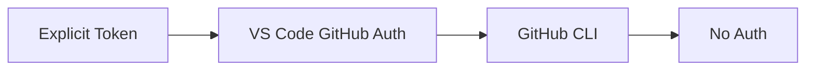

# Authentication

GitHubAdapter and AwesomeCopilotAdapter support private repos via a three-tier auth chain.

## Authentication Chain



## Implementation

```typescript
private async performAuthentication(): Promise<string | undefined> {
    // 1. Explicit token from source configuration (highest priority)
    const explicitToken = this.getAuthToken();
    if (explicitToken?.trim()) return explicitToken.trim();
    
    // 2. VS Code GitHub authentication
    const session = await vscode.authentication.getSession('github', ['repo'], { createIfNone: true });
    if (session) return session.accessToken;
    
    // 3. GitHub CLI
    const { stdout } = await execAsync('gh auth token');
    if (stdout.trim()) return stdout.trim();
    
    // 4. No authentication
    return undefined;
}
```

## GitHub CLI Timeout

The GitHub CLI step (step 3) includes a **3-second timeout** to prevent indefinite hangs when `gh` is unresponsive, missing, or misconfigured. If the timeout is exceeded, the authentication chain falls through to "No auth" and the request proceeds with rate-limited anonymous access. This timeout ensures the extension remains responsive during authentication edge cases.

## Token Format

Uses GitHub token format:
```typescript
headers['Authorization'] = `token ${token}`;
```

## Logging

Success:
```
[GitHubAdapter] ✓ Using explicit token from configuration
[GitHubAdapter] Token preview: ghp_abc1...
```

Or:
```
[GitHubAdapter] ✓ Using VSCode GitHub authentication
[GitHubAdapter] Token preview: gho_abc1...
```

Failure:
```
[GitHubAdapter] ✗ No authentication available - API rate limits will apply and private repos will be inaccessible
[GitHubAdapter] HTTP 404: Not Found
```

## Token Caching

- Cached after first successful retrieval
- Persists for adapter instance lifetime
- Tracks which method was successful

## Account Selection on First Run

When AI Primitives Hub is installed for the first time (setup state
`NOT_STARTED`), `Extension.initializeHub()` calls
`promptGitHubAccountSelection` before the hub selector opens. That helper
invokes:

```typescript
vscode.authentication.getSession('github', ['repo'], {
  clearSessionPreference: true,
  createIfNone: true,
});
```

`clearSessionPreference: true` forces VS Code's native account picker to
appear — including the "Sign in to another account…" entry — even when a
trusted session already exists. This prevents the extension from silently
inheriting whichever default account VS Code has chosen, which is the
root cause of "I can't see my private hub even though I'm logged in"
reports.

After the user picks an account, VS Code persists that preference. All
subsequent auth calls in the extension (hub sync, every adapter) use the
standard chain above without `clearSessionPreference`, so they silently
reuse the chosen account.

If the user dismisses the picker, `promptGitHubAccountSelection` throws;
the existing catch in `initializeHub` calls
`SetupStateManager.markIncomplete()` and the marketplace renders the
"Setup Not Complete" empty state on the next launch. The "Force GitHub
Authentication" command (`promptregistry.forceGitHubAuth`) remains the
path to re-pick an account later.

## Diagnosing a Rejected Credential

`raw.githubusercontent.com` — where every collection manifest, bundle
file and hub config is fetched from — **never answers 401 or 403**. A
rejected token, a token without the `repo` scope, a token that is not
SAML-SSO-authorized for the owning organization, and a path that truly
does not exist all produce the same response:

```
GitHub API error: 404 - Not found or not accessible. Check authentication.
```

A failing request is never silently worked around — `GitHubApiClient` does
not retry without the credential, because serving the content anonymously
would hide the fault instead of fixing it. Two mechanisms name the root
cause instead, and both end at the same remediation: reset the token.

**1. Auth context on every fatal error.** Fatal GitHub errors carry a
redacted credential descriptor plus whatever GitHub said about it:

```
GitHub API error: 404 - ... (https://raw.githubusercontent.com/org/repo/main/collections/a.collection.yml)
  [auth=token ***<len=82,tail=4f2a>, token-scopes=read:user, accepted-scopes=repo, sso=required]
```

- `auth=anonymous` — no provider in the chain had a credential.
- `token-scopes` missing `repo` — private repositories are invisible.
- `sso=…` — the token needs authorizing for that organization.

Token values are never logged; `redactToken` keeps only length and the
last four characters, which is enough to compare against `gh auth token`.

**2. The `Diagnose GitHub Authentication` command**
(`promptregistry.diagnoseGitHubAuth`). Resolves a credential through the
adapters' own provider chain (reporting *which* link produced it), then
probes `api.github.com` — which is honest about auth failures — with
`diagnoseGitHubTokenForRepos`: one `GET /user` for validity, scopes and
login, then a concurrent `GET /repos/{owner}/{repo}` per repository. Repo
probes are skipped when `/user` already rejected the token, so a dead
credential costs a single request.

It runs in one of two shapes:

| Shape | Trigger | Scope |
|---|---|---|
| Targeted | `execute({ url, label })` — a failed install passes the URL from the error | just that repository + one control probe |
| Sweep | command palette | every distinct GitHub source repository |

A **control probe** (`probeRawContentWithCredential`) then fetches a
known-public raw URL — the recommended default hub's README — with the
credential and, only if that fails, without it. This is a diagnosis, not a
fallback: nothing the user asked for is served from it. It separates the
last two explanations a 404 can have:

- authenticated read succeeds → the credential works on the host that
  serves bundles, so the original 404 was about that path or repository;
- authenticated read fails where the anonymous one succeeds → GitHub is
  rejecting the credential, and no private content will load until it is
  replaced.

Every verdict is logged, and the notification ends on `Reset GitHub
Token`, which runs the force-auth command (`forceNewSession` +
`clearSessionPreference`: a brand-new token and a chance to switch
accounts). A marketplace install that fails with a GitHub 401/403/404
launches the targeted diagnosis automatically.

`VsCodeSessionTokenProvider` also logs the account label, the scopes VS
Code actually granted (a reused session can be narrower than requested)
and the redacted token on every resolution, so the credential behind a
later 404 is identifiable from the log alone.

## See Also

- [Adapters](./adapters.md) — Adapter implementations
- [User Guide: Sources](../../user-guide/sources.md) — Configuring authentication
