# AI Primitives Hub: Complete Architecture and Code-Flow Guide

This guide explains the whole AI Primitives Hub in one place. It is written for a
new contributor who wants to understand **why the project exists**, **how the pieces
fit together**, and **which code runs for the important user journeys**.

The short version is:

> AI Primitives Hub is a package manager and marketplace for reusable AI resources.
> It discovers prompts, instructions, agents, skills, plugins, hooks, and MCP servers,
> then installs them into the correct files and folders for supported AI tools.

## 1. The problem the project solves

AI tools use many kinds of reusable resources, but every tool stores them differently.
Without a hub, developers must discover files manually, copy them into tool-specific
folders, remember where they came from, and repeat the work whenever a new version is
published.

AI Primitives Hub adds a managed flow:

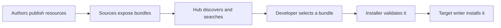

This provides:

- discovery and search across multiple sources;
- consistent validation and packaging;
- user-level and repository-level installation;
- target-specific paths and transformations;
- version, update, and uninstall tracking;
- curated hubs and role-based profiles;
- MCP configuration merging without replacing unrelated user settings.

## 2. Vocabulary: the nouns used throughout the code

| Term | Simple meaning | Example |
|---|---|---|
| Primitive | One reusable AI resource | A code-review prompt or an MCP server |
| Collection | Author-owned group of primitives | A Python developer toolkit |
| Bundle | Versioned installable output of a collection | `python-toolkit@2.1.0` |
| Source | Location that provides bundles | GitHub, Azure DevOps, or a local folder |
| Hub | Curated catalogue of sources and profiles | An organisation's approved catalogue |
| Profile | Named set of bundles | Backend developer profile |
| Target | Tool and scope receiving installed files | Kiro repository scope |
| Port | Interface describing a capability | `BundleDownloader` |
| Adapter | Concrete implementation of a port | `HttpsBundleDownloader` |
| Layout | Mapping from primitive kinds to target paths | `prompts/` to `.kiro/steering/` |
| Lockfile | Repository installation record | `prompt-registry.lock.json` |

The main content journey is:

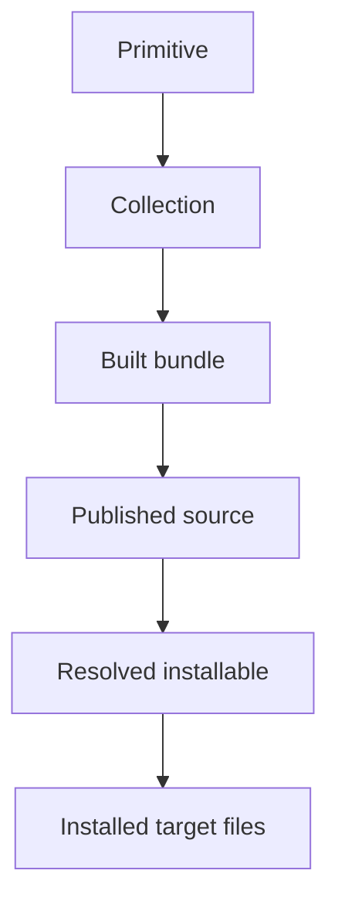

## 3. Repository map

```text
ai-primitives-hub/
├── packages/
│   ├── core/                 domain rules and port interfaces
│   ├── infra/                external-system implementations
│   ├── app/                  use-case orchestration
│   └── cli/                  terminal delivery layer
├── apps/
│   └── vscode-extension/     VS Code marketplace and commands
├── lib/                      legacy collection build/publish tooling
├── github-actions/           reusable collection validation action
├── docs/                     documentation source
├── website/                  Docusaurus documentation website
└── config/                   default hub configuration
```

The repository is a pnpm monorepo. The root workspace currently requires Node.js 24
or newer and pnpm 11 or newer. Always verify the exact pinned version in the root
`package.json` before setting up a development environment.

## 4. Architectural style: ports and adapters

The shared packages use Clean Architecture, also called ports-and-adapters or
hexagonal architecture.

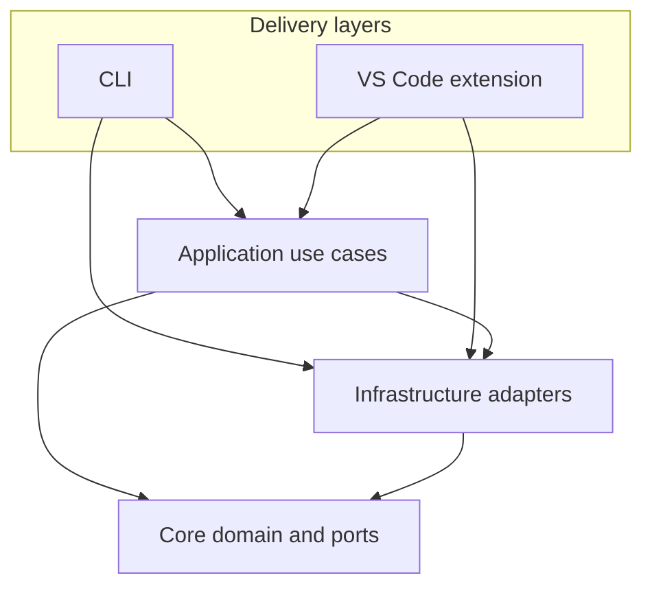

The important rule is that dependencies point toward stable business concepts.

| Layer | Owns | Must not own |
|---|---|---|
| `core` | Domain types, rules, errors, ports | VS Code, Node filesystem, HTTP clients |
| `infra` | GitHub/ADO clients, ZIP, filesystem, search, stores | UI or VS Code behaviour |
| `app` | Use-case sequencing | Tool-specific UI and new domain rules |
| `cli` | Argument parsing and output formatting | Reusable business logic |
| Extension | VS Code commands, progress, notifications, views | Logic already reusable by CLI |

### 4.1 A port and its adapter

Core declares what the application needs:

```typescript
export interface BundleExtractor {
  extract(bytes: Uint8Array): Promise<ExtractedFiles>;
}
```

Infrastructure supplies a real implementation:

```typescript
export class ZipBundleExtractor implements BundleExtractor {
  public async extract(bytes: Uint8Array): Promise<ExtractedFiles> {
    // Decode the ZIP and return path -> bytes.
  }
}
```

Tests can inject a tiny in-memory implementation. Production can inject ZIP, HTTP,
GitHub, Azure DevOps, or filesystem implementations without changing the use case.

### 4.2 Strangler-fig migration

The VS Code extension existed before the shared packages. It is being migrated a
piece at a time:

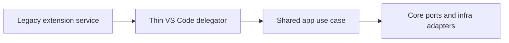

Therefore, some workflows still contain business logic under
`apps/vscode-extension/src/services`. New reusable logic should normally enter
`core`, `infra`, or `app`, and the extension service should adapt it to VS Code.

## 5. Shared package responsibilities

### 5.1 `packages/core`: language and contracts

Important areas:

| Path | Responsibility |
|---|---|
| `domain/primitive` | Primitive kinds and metadata |
| `domain/collection` | Collection types and validation |
| `domain/bundle` | Bundle identity and version types |
| `domain/source` | Source types and validation result |
| `domain/install` | Targets, layouts, transforms, installable types |
| `domain/hub` | Hubs and profiles |
| `ports` | Interfaces for external capabilities |
| `public/schemas` | Public JSON schemas |

Core should answer questions such as "what is a target?" and "is this manifest
valid?" It should not answer "where is VS Code installed on Windows?"

### 5.2 `packages/infra`: the outside world

Infra contains:

- source adapters for GitHub, Azure DevOps, local, Awesome Copilot, APM, and skills;
- token providers and HTTP/API clients;
- ZIP download and extraction;
- local filesystem and process execution;
- JSON stores, layouts, and repository writers;
- harvesting and BM25 search;
- scaffolding templates and telemetry transports.

### 5.3 `packages/app`: user journeys

App coordinates ports and adapters. Major use cases include:

- bundle installation and uninstallation;
- registry bundle resolution and installation;
- hub and profile lifecycle;
- discovery and recommendations;
- target transformation;
- update checks and auto-update;
- lockfile operations.

### 5.4 `packages/cli`: terminal delivery

The CLI uses Clipanion. A command should:

1. parse arguments;
2. validate user input;
3. construct or receive dependencies;
4. call an app use case;
5. format text, JSON, YAML, or NDJSON output;
6. return a meaningful exit code.

### 5.5 `apps/vscode-extension`: graphical delivery

The extension owns:

- activation and command registration;
- Marketplace WebView and installed-resource TreeView;
- scope selection, progress, and notifications;
- VS Code storage integration;
- repository activation;
- target-host detection;
- extension-side MCP lifecycle while migration is incomplete.

## 6. Source discovery and synchronisation flow

Every source looks different externally, but the application talks to a shared
`SourceAdapter` contract.

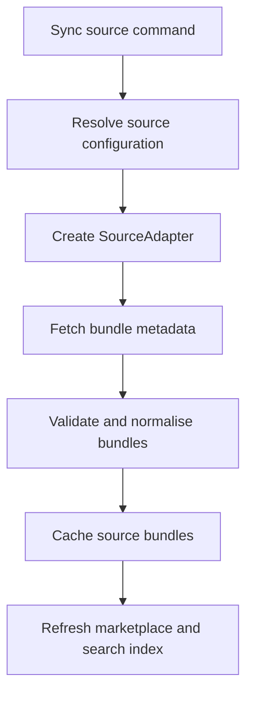

Adapter selection is based on `RegistrySource.type`:

```text
github | azure-devops | local | awesome-copilot | local-awesome-copilot
apm | local-apm | skills | local-skills
```

The Azure DevOps implementation follows the same structure as GitHub:

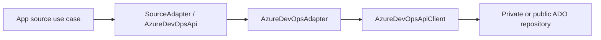

## 7. Generic bundle installation pipeline

The shared installation pipeline lives in `packages/app/src/install/pipeline.ts`.

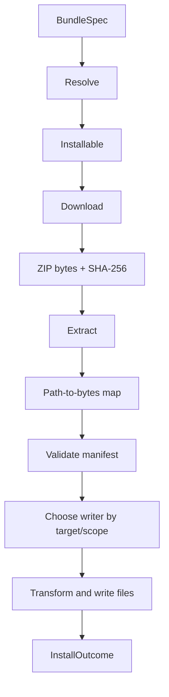

Conceptually, the code is:

```typescript
const installable = await resolver.resolve(spec);
const download = await downloader.download(installable);
const files = await extractor.extract(download.bytes);
const manifest = validateManifest(files, expectedIdentity);
const writer = writerFactory(target);
const writeResult = await writer.write(target, files);
```

Each stage emits a structured event such as `resolve.start`, `extract.done`, or
`write.done`. Failures are wrapped with a stage and stable error code.

| Stage | Typical code |
|---|---|
| Resolve | `BUNDLE.NOT_FOUND` |
| Download | `NETWORK.DOWNLOAD_FAILED` |
| Extract | `BUNDLE.EXTRACT_FAILED` |
| Validate | `BUNDLE.MANIFEST_INVALID` |
| Write | `FS.WRITE_FAILED` |

## 8. Target layout and transformation

A bundle stores canonical paths such as `prompts/`, `agents/`, and `skills/`.
Each target layout maps those prefixes to real target directories.

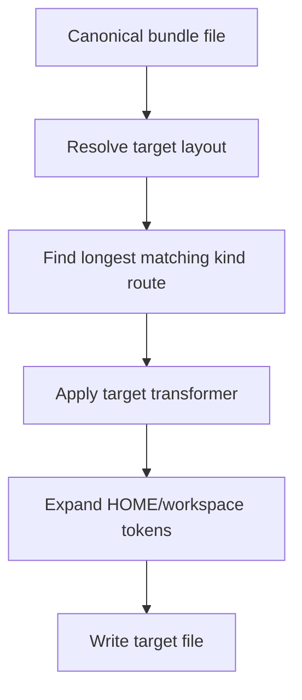

Examples:

| Canonical kind | VS Code repository | Kiro repository | Claude Code repository |
|---|---|---|---|
| Prompts | `.github/prompts/` | `.kiro/steering/` | `.claude/commands/` |
| Instructions | `.github/instructions/` | `.kiro/steering/` | `.claude/instructions/` |
| Agents | `.github/agents/` | `.kiro/agents/` | `.claude/agents/` |
| Skills | `.github/skills/` | `.kiro/skills/` | `.claude/skills/` |

The built-in source of truth is
`packages/infra/src/writers/default-layouts.json`. Higher-level layout files can
override built-in routes. `FileTreeTargetWriter` performs generic target writing;
repository scope can use a specialised writer for lockfile and commit behaviour.

## 9. Actual VS Code extension installation flow

The extension uses both migrated shared use cases and extension-side services.

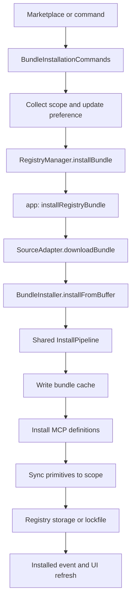

### 9.1 Command layer

`BundleInstallationCommands` searches/selects a bundle, asks for scope and
auto-update preference, shows progress, and calls `RegistryManager`.

### 9.2 Registry use case

`RegistryManager.installBundle` delegates reusable sequencing to
`installRegistryBundle`. The use case:

1. resolves the requested version;
2. checks for an existing installation;
3. finds the bundle's source;
4. obtains the correct source adapter;
5. downloads the bundle or creates a local-skill symlink;
6. records successful non-repository installations;
7. cleans up superseded version records.

### 9.3 Extension bridge into the shared pipeline

The adapter already returned a bundle `Buffer`. `BundleInstaller` creates tiny
resolver/downloader adapters around this resolved buffer, then reuses the shared
extract, validate, and write pipeline. Bundles without a deployment manifest may
receive a minimal generated manifest before validation.

### 9.4 Cache, activation, and state

Standard bundle files are first placed in extension-managed bundle storage. Scope
services then activate the relevant files in the selected IDE directories.

- user/workspace installations are recorded in registry storage;
- repository installations are represented in `prompt-registry.lock.json`;
- repository commit mode controls whether generated files are committed or kept
  local through `.git/info/exclude`.

## 10. CLI flow

The CLI entry point creates a production context, HTTP client, and token provider,
then Clipanion selects a command.

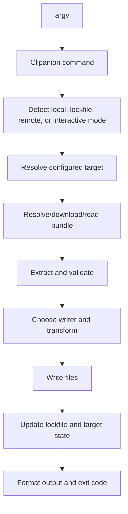

The current CLI is mid-migration: the shared `InstallPipeline` exists, while some
paths in the large install command still execute equivalent stages directly. When
changing install behaviour, verify both CLI and extension paths and prefer moving
reusable sequencing into `app` rather than adding another delivery-layer copy.

## 11. Installation scopes

| Scope | Meaning | State owner |
|---|---|---|
| User | Available globally to one developer | Registry/user storage |
| Workspace | Available in the current editor workspace | Workspace/registry storage |
| Repository | Travels with or is associated with the repository | Repository lockfile |

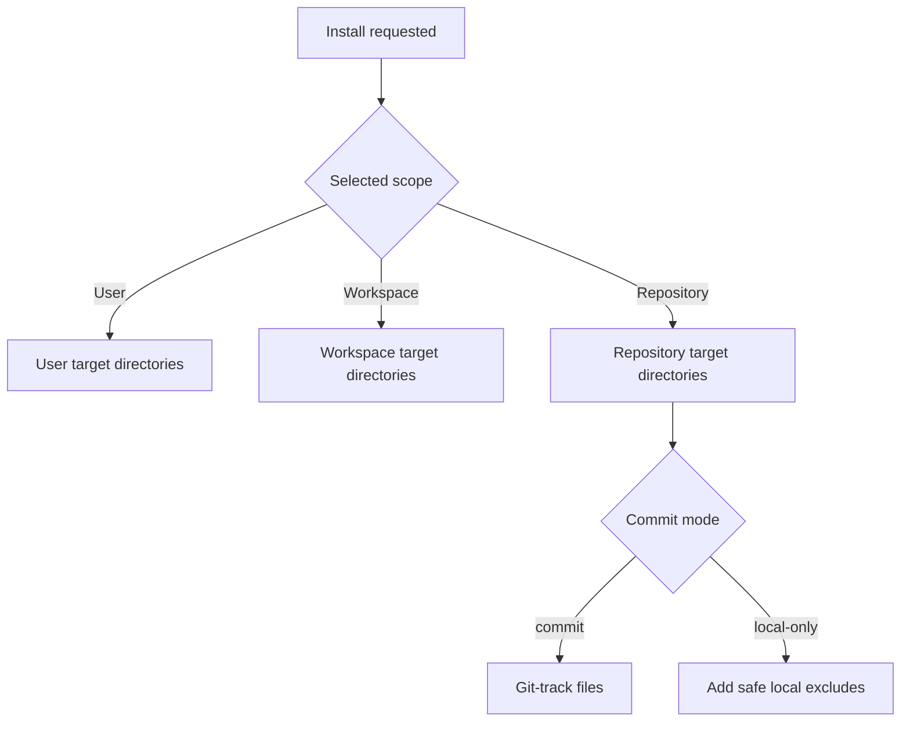

Scope conflicts matter because the same bundle at multiple levels may cause unclear
precedence. `ScopeConflictResolver` and scope migration commands help users move or
reconcile installations.

## 12. MCP architecture

MCP definitions are configuration entries, not ordinary copied Markdown files. The
installer must merge them into an existing host file without deleting user state.

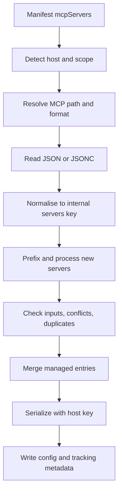

### 12.1 Host-aware MCP locations

| Host | User file | Repository file | Server-map key | Input prompts |
|---|---|---|---|---|
| VS Code | VS Code user `mcp.json` | `.vscode/mcp.json` | `servers` | Supported |
| VS Code Insiders | Insiders user `mcp.json` | `.vscode/mcp.json` | `servers` | Supported |
| Kiro | `~/.kiro/settings/mcp.json` | `.kiro/settings/mcp.json` | `mcpServers` | Not supported |
| Windsurf | `~/.codeium/windsurf/mcp_config.json` | None | `mcpServers` | Not supported |
| Claude Code | `~/.claude.json` | `.mcp.json` | `mcpServers` | Not supported |
| Copilot CLI | `~/.copilot/mcp-config.json` | `.mcp.json` | `mcpServers` | Not supported |

`McpConfigLocator` resolves the path from layout data. `mcp-config-format.ts`
normalises either `servers` or `mcpServers` into one internal shape and serialises
back to the host's required key. It uses JSONC parsing so comments and trailing
commas survive valid VS Code workflows.

### 12.2 Safety and ownership

MCP tracking metadata records which entries were installed by which bundle. This is
needed because uninstall must not remove a manually created server or a shared server
still needed by another bundle. The merge also preserves unrelated top-level state,
which is especially important for Claude Code's combined configuration file.

### 12.3 Known MCP limitations

- User/project layout overrides are not yet threaded into extension MCP resolution.
- VS Code's current API does not expose a reliable active-profile MCP path, so
  user-scope writes target the default profile.
- `${input:id}` is a VS Code-specific prompt mechanism. Other hosts require a clear
  warning or direct secret configuration rather than synthetic input declarations.
- Full reference-counted conflict handling for semantically identical MCP servers
  remains an open design area.

## 13. Search and discovery

Sources are harvested into primitive records and indexed using BM25.

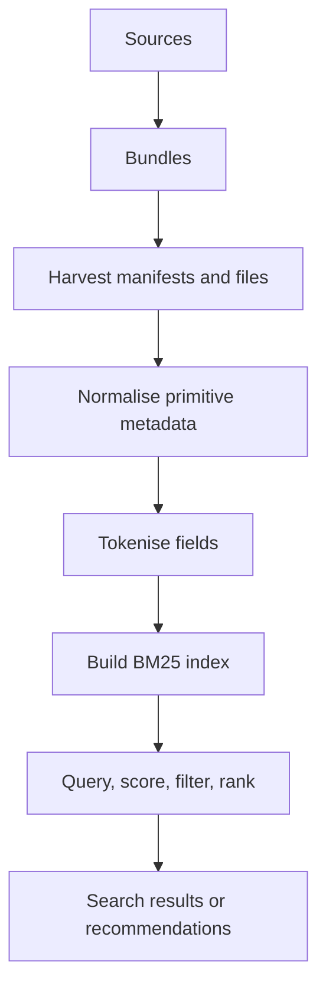

BM25 rewards useful term matches while reducing the value of repeated common words.
Search quality depends on consistent title, description, tags, kind, source, and
preview metadata. Any richer extension search should reuse the infra search/index
capabilities rather than creating a separate WebView-only algorithm.

## 14. Hubs and profiles

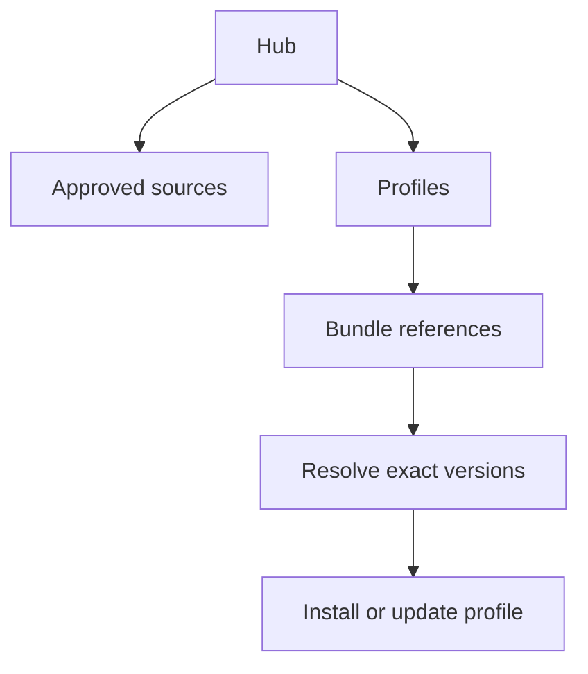

A source answers "where are bundles?" A hub answers "which sources and profiles are
approved?" A profile answers "which bundles should this role or project receive?"

## 15. Update and uninstall flows

### Update

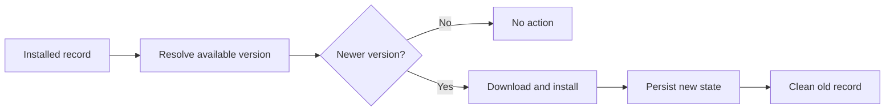

The new installation is recorded before old records are cleaned so a cleanup failure
does not lose the working installation.

### Uninstall

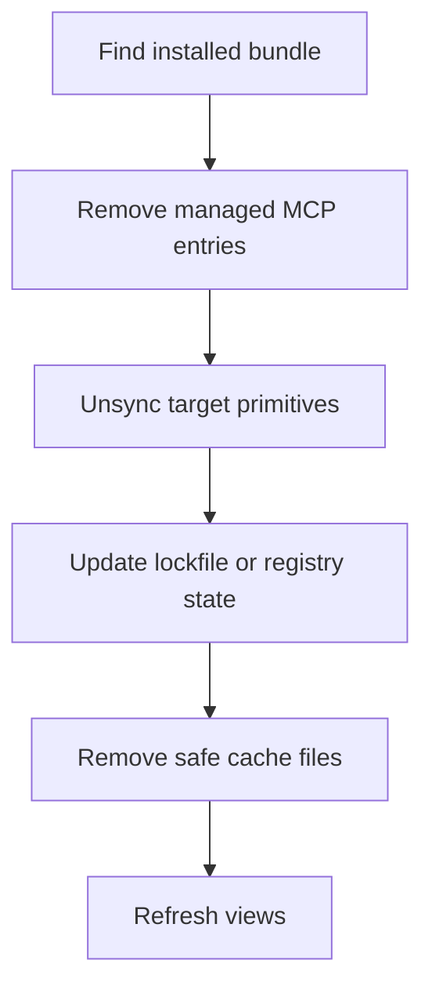

## 16. Persistence model

| State | Typical owner |
|---|---|
| Configured sources | Registry storage |
| Cached source bundles | Registry/source cache |
| Active hub and profiles | App storage/hub store |
| User/workspace installations | Registry storage |
| Repository installations | `prompt-registry.lock.json` |
| Target state | Target state store |
| MCP ownership | MCP tracking metadata beside config |
| Search index | Infra index storage |

The old `prompt-registry` machine names are deliberately retained for compatibility.
Do not rename lockfiles, extension identifiers, or command IDs merely for consistency.

## 17. Authentication

Authentication is another port-and-adapter chain:

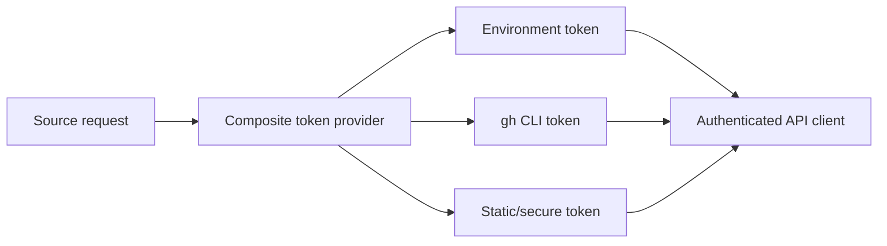

Tokens should be referenced by environment/secure-storage key, never committed into
source or hub configuration. Source adapters consume API ports rather than reading
credentials directly throughout the code.

## 18. Validation and collection build flow

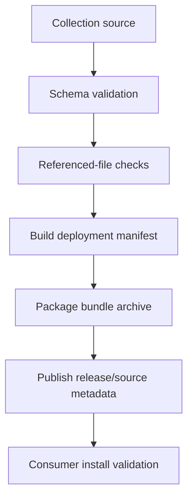

Validation happens both when authors build collections and when consumers install a
bundle. Consumer validation checks identity and version expectations so a source
cannot silently return a different bundle than the one requested.

## 19. Testing and CI architecture

| Area | Framework or check |
|---|---|
| Shared packages | Vitest unit tests |
| VS Code extension | Mocha unit/integration/E2E tests |
| TypeScript | Package builds and extension compile |
| Style | ESLint with repository configuration |
| Dependencies | Audit, dependency review, scorecard/SBOM workflows |
| Documentation | Docusaurus website build |
| Distribution | VSIX packaging and package release workflow |

The safe contribution loop is:

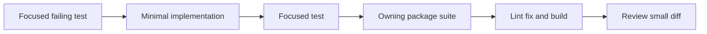

Tests should exercise observable behaviour through public entry points. Mock external
boundaries such as HTTP, filesystem, time, or process execution—not the logic being
tested.

## 20. Composition roots: where concrete objects are assembled

Clean layers become useful only when a delivery layer joins interfaces to real
implementations.

### CLI composition

`packages/cli/src/main.ts` and the framework production context assemble Node HTTP,
filesystem, token providers, stores, resolvers, extractors, and writers.

### Extension composition

`apps/vscode-extension/src/extension.ts` constructs `RegistryManager`, commands,
views, schedulers, and repository services using `ExtensionContext`.

This is the right place for construction. A core domain type should never create a
VS Code notification or instantiate a network client.

## 21. How to trace code without getting lost

Use this reading order:

1. Read root and nearest `AGENTS.md` files.
2. Learn primitive, collection, bundle, source, installable, and target types.
3. Read the resolver/downloader/extractor/writer ports.
4. Trace `InstallPipeline` with its tests.
5. Read layout resolution and `FileTreeTargetWriter`.
6. Trace CLI install from `main.ts` to its writer.
7. Trace extension install from command to `RegistryManager`, app use case, and
   `BundleInstaller`.
8. Read one source adapter and its fake-backed tests.
9. Read MCP layouts, locator, format helper, config service, and manager—in that order.
10. Read search harvesting, indexing, and UI integration last.

## 22. Where new changes belong

| Change | Correct first location |
|---|---|
| New primitive rule | `packages/core` |
| New external source | Core port/type if needed, then `packages/infra` adapter |
| Reusable workflow | `packages/app` |
| New terminal presentation | `packages/cli` |
| VS Code dialog or notification | VS Code extension |
| New target path | Layout configuration |
| Target content conversion | Transformer registry/transformer |
| MCP file merge rule | Reusable domain/app logic where host-neutral; extension adapter where VS Code-specific |

Before adding code, search for an existing helper and read the closest tests. The
project is actively consolidating duplicated extension and CLI behaviour.

## 23. Known architectural seams and contribution opportunities

These are not promises of accepted designs; discuss them with maintainers before a
large implementation.

1. Route remaining CLI install paths through the shared installation pipeline.
2. Finish migrating extension service business logic into shared packages.
3. Introduce a dedicated MCP target writer for CLI/multi-target installation.
4. Thread user/project layout layers into extension MCP resolution.
5. Improve MCP shared-server ownership and reference-counted uninstall behaviour.
6. Connect richer marketplace search to the shared search index.
7. Add measurable search-quality evaluation rather than tuning by intuition.
8. Make installation scope and cross-scope availability clearer in the UI.

## 24. Mental model to remember

When the repository feels large, remember this five-step model:


- **Discover** bundles through sources, hubs, and search.
- **Resolve** the requested bundle and exact version.
- **Validate** its identity, manifest, and referenced files.
- **Transform** canonical resources into target-specific paths and formats.
- **Track** ownership so updates and uninstalls remain safe.

## See also

- [Architecture overview](../architecture.md)
- [Installation flow](./installation-flow.md)
- [MCP integration](./mcp-integration.md)
- [Packages codemap](./library-centric-architecture/codemap.md)
- [ADR index](./adr/adr-index.md)
- [Testing guide](../testing.md)
