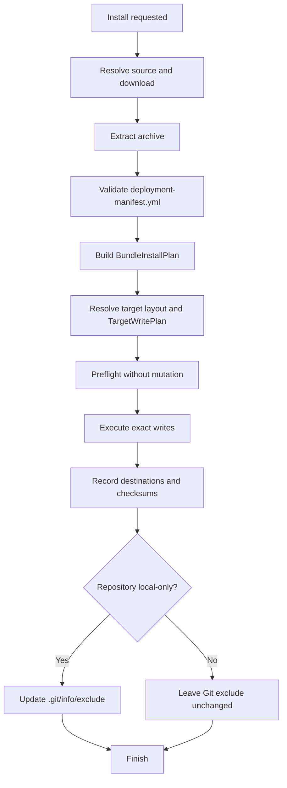

# Installation Flow

The CLI and VS Code extension share one manifest-driven installation pipeline.
Delivery layers select a source, target, scope, and execution policy; semantic
placement belongs to the shared `core` and `app` packages.

## Shared Pipeline


`BundleInstallPlan` is target-neutral. Manifest item IDs, declared paths, and
canonical primitive kinds are authoritative; archive directory prefixes do not
select target routes. `TargetWritePlan` resolves those semantic items against a
selected target and scope. Writers execute exact destination operations and do
not parse manifests or infer kinds.

Governed manifests use `items[]` and the `files[]` inventory. Legacy manifests
with item declarations are normalized into the same model. Identity-only legacy
manifests remain supported through one deprecated prefix-inference fallback,
which reports inferred paths with `BUNDLE.LEGACY_KIND_INFERENCE`.



## User Scope

Bundles are retained in extension storage and their primitives are synced to
host-specific user directories. Paths are selected by target layout, not by the
source archive's wrapper directory.

```
Extension Storage/
├── bundles/
│   └── testing-automation/
│       ├── deployment-manifest.yml
│       └── prompts/
│           └── testing-prompt.prompt.md
└── registry.json

Copilot Directory (macOS)/
~/Library/Application Support/Code/User/prompts/
└── testing-prompt.prompt.md
```

## Repository Scope

Repository layouts are target-specific but use the same semantic plan:

```
your-repo/
├── .github/
│   ├── prompts/
│   │   └── my-prompt.prompt.md
│   ├── agents/
│   │   └── my-agent.agent.md
│   ├── instructions/
│   │   └── my-instructions.instructions.md
│   └── skills/
│       └── my-skill/
│           └── SKILL.md
├── .vscode/
│   └── mcp.json
├── prompt-registry.lock.json
└── prompt-registry.local.lock.json
```

Built-in and user/project layouts map canonical kinds such as `prompt`,
`instruction`, `chat-mode`, `agent`, `skill`, `hook`, and `plugin` to output
folders. Existing persisted prefix keys such as `prompts/` and `agents/` are
normalized at the configuration boundary; canonical keys win when both forms
are present.

For local-only installs, destination paths are added to `.git/info/exclude`.
The local lockfile is also excluded when it is created. Repository rollback and
uninstall remove the exact recorded destinations and do not reread the source
manifest.

## Scope Selection

The extension presents repository commit, repository local-only, and user
profile choices. Repository choices require an open workspace. A scope conflict
is resolved by uninstalling the old scope, installing the new scope, and
restoring the old installation if the new write fails.

## Binary Safety And Integrity

- Writers use byte-level filesystem operations for binary content. Strict UTF-8 text may pass through a target transformer; binary content is never decoded as text.
- Every write is reread and compared with the intended bytes. Mismatches fail with `BUNDLE.INTEGRITY_MISMATCH`.
- Governed manifests validate archive inventory sizes and SHA-256 digests before any target mutation.
- Lockfiles record destination-relative paths and post-transform `installedChecksum` values returned by the writer.

## Lockfiles

Repository installs use two compatible lockfiles:

| Lockfile | Purpose |
|---|---|
| `prompt-registry.lock.json` | Committed bundles |
| `prompt-registry.local.lock.json` | Local-only bundles |

The lockfile schema version remains `2.0.0`. New entries use the installed file
records returned by `TargetWriteResult`; update, rollback, and uninstall use the
same records. Historical entries with old source-prefix paths are handled only
by an isolated read-time compatibility path and are not used for new entries.
