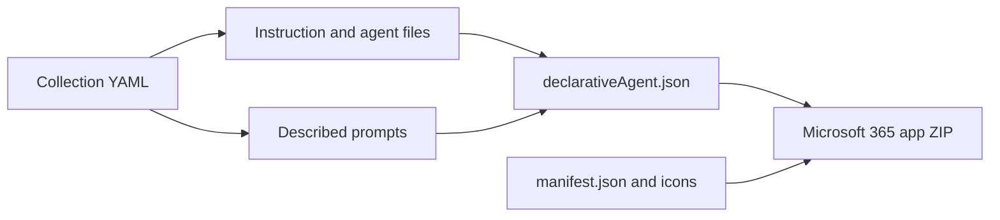

# Microsoft 365 Copilot support MVP

Microsoft 365 Copilot does not consume portable `SKILL.md` folders directly. Its closest packaging model is a declarative agent: a Microsoft 365 app ZIP containing an app manifest, a declarative-agent manifest, and two icons.

## What the MVP exports



The `bundle export-m365` command:

- combines `instruction` and `agent` files into the agent instructions, enforcing Microsoft's 8,000-character limit;
- turns described prompt items into up to 12 conversation starters;
- generates Microsoft 365 app manifest 1.29 and declarative-agent manifest 1.8;
- validates the required 192×192 color and 32×32 outline PNG dimensions;
- creates a deterministic ZIP suitable for validation and tenant testing.

Example:

```bash
ai-primitives-hub bundle export-m365 \
  --collection-file collections/review.collection.yml \
  --app-id 00000000-0000-4000-8000-000000000000 \
  --developer-name Contoso \
  --website-url https://example.com \
  --privacy-url https://example.com/privacy \
  --terms-url https://example.com/terms \
  --color-icon assets/color.png \
  --outline-icon assets/outline.png
```

## Deliberate limitations

Portable skills are not silently converted. Microsoft 365 uses the word *skill* for built-in capabilities and custom MCP/API actions, which require platform manifests, HTTPS endpoints, authentication, consent, and security review. MCP declarations therefore need a later, explicit plugin-export phase. The generated package must still be validated with Microsoft 365 Agents Toolkit and tested in a licensed tenant before deployment.

## Next phases

1. Add an MCP plugin-manifest generator with authentication mapping.
2. Add Microsoft schema validation in CI.
3. Add knowledge-source mapping and tenant capability checks.
4. Add publishing through Microsoft 365 Agents Toolkit after an explicit user confirmation step.

## Primary references

- [Declarative agent schema 1.8](https://learn.microsoft.com/en-us/microsoft-365/copilot/extensibility/declarative-agent-manifest-1.8)
- [Microsoft 365 app model for agents](https://learn.microsoft.com/en-us/microsoft-365/copilot/extensibility/agents-are-apps)
- [Microsoft 365 app manifest schema](https://learn.microsoft.com/en-us/microsoft-365/extensibility/schema/?view=m365-app-1.29)
- [Add skills to a declarative agent](https://learn.microsoft.com/en-us/microsoft-365/copilot/extensibility/build-declarative-agents-add-skills)
- [Build a plugin from an MCP server](https://learn.microsoft.com/en-us/microsoft-365/copilot/extensibility/build-mcp-plugins)
